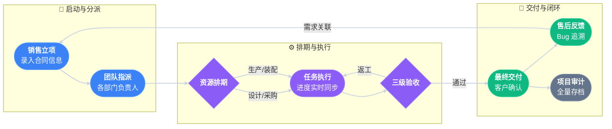

# 工业流程 ERP 系统 (开源版) - Industrial Flow ERP


这是一个基于 Python Flask 打造的现代化工业流程管理系统，专为中小型制造企业设计。相比于市面上通用的 ERP，本项目**核心聚焦于以下企业级价值点**：

1.  **🌍 零成本异地办公**: 提供完整的 **“内网部署 + Tailscale 专用隧道”** 免费解决方案，即可内网使用也可异地使用，无需公网 IP 也能安全远程访问。
2.  **🛡️ 严密的权限分层**: 实现了 **老板-部门负责人-员工-客户** 四级权限隔离，确保数据安全边界。
3.  **💬 多通道消息通知**: 集成 **企业微信、钉钉、邮件及手机短信** 为一体的通知后端，关键节点手动自选通知方式指定提醒负责人。
4.  **📂 结构化文件管理**: 文件按 **“合同编号”** 自动归档隔离，确保不同项目资料清晰有序，互不干扰。
5.  **📄 实时文档引擎**: 内置 Office/PDF/图片 预览引擎，图纸与技术文档无需下载，在线即阅。
6.  **👥 灵活的团队管理**: 合同生命周期中的**工作人员可自由增减**，人员档案（姓名、邮箱、联系方式）自动对应通知后端。
7.  **📜 全程操作审计**: 后台完整记录所有人员的 **操作日志**，每一项改动均可回溯，保障系统安全。
8.  **📊 全流程闭环**: 涵盖从 合同生命周期 到 **精准的工期管理**，再到 生产任务追踪 与 组织架构管理 的完整数据闭环。
9.  **🖥️ Windows 生产级托管**: 支持 **NSSM + Waitress** 托管模式，实现开机自启与 24 小时无人值守运行，确保系统在 Windows 环境下稳定常驻。**只需一台机器部署即可供团队所有人使用**。系统也兼容Linux环境。

### 软件的详细页面情况及介绍请点击查看 [USER_GUIDE.md](USER_GUIDE.md) 或 [USER_GUIDE_EN.md](USER_GUIDE_EN.md)。

## 🔄 核心工作流 (Standard Workflow)




### 详细步骤说明

1.  **立项 (Create)**:
    - 销售人员创建新合同，填写交期、合同编号、项目总负责人、客户信息等。
    - 系统生成唯一的项目编号。

2.  **分派 (Assign)**:
    - 管理员为项目指定不同部门的负责人 (Feature Leader)。
    - 指定各部门相应负责人收到通知。

3.  **排期 (Plan)**:
    - 录入具体的生产任务 (Tasks)，设定起止时间和相应内容。
    - 自动生成甘特图。
    - 各部门负责人可随时查看本部门任务进度，并可手动指定提醒。

4.  **执行 (Execute)**:
    - 员工更新任务进度 (0% -> 100%)。
    - 如需采购，录入采购清单，追踪到货情况。
    - 各部门负责人可随时查看本部门任务进度，并可手动指定提醒。

5.  **验收 (Accept)**:
    - 任务完成后发起验收申请。
    - 质检人员标记验收由“审核中”变更为“通过”或“驳回”。

6.  **交付与售后 (Deliver & Feedback)**:
    - 记录最终交付时间。
    - 记录客户反馈（Bug/需求），并关联回具体项目进行迭代。

7.  **项目存档 (Archive)**:
    - 项目完成后，将项目存档。
    - 项目情况可筛选、查询和追溯。

## 🚀 核心特色 (Unique Features)


### 1. 工业美学看板 (Bento Grid Dashboard)


放弃了传统的表格堆砌，采用 Bento Grid 风格的仪表盘。

- **多维状态可视化**: 采用六色光效语义化展示项目状态，一眼即识：
  - 🟣 **生产中 (Production)**: 紫色脉冲，代表核心制造环节。
  - 🔵 **进行中 (Processing)**: 蓝色高亮，代表常规任务推进。
  - 🟠 **验收/问题 (Issue)**: 橙色警示，代表等待验收或存在反馈。
  - 🟢 **已验收 (Accepted)**: 绿色完成，代表交付无误。
  - 🔘 **未启动 (Unstarted)**: 灰色静默，代表立项待办。
  - 🔴 **延误 (Risk)**: 红色高亮 (在甘特图中体现)，代表进度逾期。
- **关键指标**: 首页直观呈现“进行中合同”、“待办任务”、“本月交付”等核心 KPI。

### 2. 动态甘特图 (Interactive Gantt Chart)

内置 Frappe Gantt 引擎，自动根据任务起止时间生成动态时间轴。

- 支持拖拽查看进度。
- 自动计算并高亮今日任务。
- 以天/周/月多维度视图展示项目全貌。

> **合同签订** ➔ **任务下达** ➔ **生产/采购** ➔ **内部验收** ➔ **客户交付** ➔ **售后反馈**

### 3. 企业级权限与安全边界 (RBAC & Security)


并非简单的登录验证，系统实现了严密的**角色分层与数据隔离**：

- **老板 (Boss)**: 上帝视角，查看所有项目、财务及员工绩效。
- **部门负责人 (Leader)**: 仅能管理本部门负责的项目任务与人员。
- **普通员工 (Staff)**: 只能访问自己参与的任务和被授权的文件。
- **客户 (Customer)**: 只能查看与自己公司相关的合同进度，绝对隔离。

### 4. 实时文档预览引擎 (Document Preview)

内置强大的文件处理引擎，让 ERP 成为企业的知识库。无需下载，直接在浏览器中预览：

- **办公文档**: 支持 Word (`.docx`), Excel (`.xlsx`), PPT (`.pptx`)。
- **专业格式**: 支持 PDF 和各类高清图片。
- **底层技术**: 采用 LibreOffice 转换服务与 PDF.js 渲染，流畅且兼容性强。

### 5. 结构化文件系统 (Isolated File System)

系统对附件存储进行了深度优化，确保资料管理的严谨性：

- **合同对齐**: 所有上传的文件均严格挂载在对应“合同编号”的文件目录下。
- **物理隔离**: 不同合同的文件在服务器存储层级即是不相通的，从根源上避免了资料混淆。
- **版本管理**: 支持对同一文件进行版本迭代，保留历史版本，防止误覆盖。

### 6. 全量操作审计 (Operation Audit Logs)


系统自带“黑匣子”功能，记录系统内发生的一切重要行为：

- **谁在干什么**: 精确记录操作人、操作时间、IP地址以及具体的改动内容（包含修改前后的值对比）。
- **回溯追踪**: 管理员可在后台通过日期、项目、人员多维度检索审计日志。
- **安全保障**: 为企业提供完整的数据变动链条，是内部风控和责任追溯的利器。

### 7. 多通道消息通知 (Multi-channel Notification)

系统内置了模块化的通知后端，支持以下通道：

- **企业微信 / 钉钉**: 通过群机器人同步项目关键变动（如任务下达、合同逾期）。
- **邮件服务**: 发送正式的业务提醒和报表。
- **手机短信**: 针对高优先级催办事件，确保信息及时送达。
- **配置**: 在 `config.py` 中选择 `NOTIFICATION_BACKEND` 并配置相应的 Token/API 即可。

### 8. 柔性团队管理 (Flexible Staffing)


针对制造业项目人员变动频繁、协作复杂的特点，系统提供了一套结构化的团队管理方案：

- **结构化档案**: 支持为每位团队成员维护详细档案，包括**姓名、个人邮箱、手机号码**、微信号以及所属部门等关键信息。
- **自动映射通知**: 核心优势在于档案与通知系统的**自动映射关联**。一旦在项目中指派了负责人，系统会自动调取其档案中的联系方式，通过邮件、短信或企业微信进行精准触达。
- **自由增减**: 在“项目详情-负责人管理”中，可随时为每个部门增加或移除协助负责人，动态适配项目规模。
- **权限联动**: 权限随人员进出项目实时更新，无需手动重置账号权限，确保数据安全。

## 🛠️ 安装与使用

### 1. 环境准备

- Python 3.8+
- SQL Server (推荐) 或其他支持 SQLAlchemy 的数据库

#### 虚拟环境搭建示例 (Windows)

```cmd
D:\code> mkdir your_erp
D:\code> cd your_erp
D:\code\your_erp> py -3 -m venv your_erp_preferred
D:\code\your_erp> venv\Scripts\activate
```

### 2. 安装 SQL Server 2022 Developer (简易指南)

如果您本地还没有数据库，推荐安装免费的开发者版：

1.  **下载**: 搜索 "SQL Server 2022 Developer" 并从微软官网下载安装程序。
2.  **安装**: 运行安装程序，选择 **"基本 (Basic)"** 安装类型即可。
3.  **工具**: 安装完成后，点击 **"安装 SSMS"** (SQL Server Management Studio) 以便图形化管理数据库。
    ps：**安装参考链接**：https://www.bilibili.com/video/BV13o4y1V7Jb?spm_id_from=333.788.videopod.episodes&vd_source=d49e0c134bc6c6180dab2a3de3c221f0

### 3. 安装依赖

```bash
pip install -r requirements.txt
```

### 4. 配置

```bash
cp config.example.py config.py
# 记得修改 config.py 中的数据库连接和 COMPANY_NAME
```

## ⚙️ 二次开发/定制指南 (Customization)

本系统针对制造业场景预设了部分逻辑，您可根据实际需求轻松修改：

### 1. 修改角色 (Roles)

系统目前的角色权限（如 `admin`, `boss`, `sales`）映射逻辑位于：

- **文件**: `core/contracts.py`
- **函数**: `normalize_role()`
- **说明**: 您可以在字典中添加新的角色映射（如 `"质检员": "qc"`），并在 `auth.py` 中扩展相应的权限装饰器。

### 2. 修改部门 (Departments)

部门数据存储在数据库 `department` 表中。

- **默认**: 采购部、销售部、机械部、电气部、软件部、调试装配部。
- **修改**: 直接操作数据库，或编写 Python 脚本调用 `db.session.add(Department(name="新部门"))` 进行初始化。

### 3. 修改文件类型 (File Types)

文件类型（合同、技术文档、图纸、其它）的下拉选项位于前端模板中：

- **文件**: `core/templates/contracts/files.html`
- **位置**: 搜索 `<select name="file_type">`
- **修改**: 直接在 HTML 中增删 `<option>` 标签即可。

### 4. 更多硬编码修改

- **`config.example.py`**: 这里的示例配置已脱敏。在实际部署时，请搜索代码全局的 `APP_` 变量，确保与您的环境变量一致。

## 📸 系统截图与功能演示 (Screenshots & Guide)

> 📖 **[点击查看完整功能演示手册 (USER_GUIDE.md)](USER_GUIDE.md)**  
> 本手册收录了 **仪表盘、项目管理、任务排期、供应链、组织架构** 等全模块的真实界面演示。


推荐使用 SQL Server Management Studio (SSMS) 执行以下脚本快速建库：

```sql
-- 1. 创建数据库
CREATE DATABASE YOUR_DATABASE_NAME;
GO

-- 2. 创建登录账号
CREATE LOGIN YOUR_USERNAME WITH PASSWORD = 'YOUR_STRONG_PASSWORD!';
GO

-- 3. 赋予权限
USE YOUR_DATABASE_NAME;
GO
CREATE USER YOUR_USERNAME FOR LOGIN YOUR_USERNAME;
GO
ALTER ROLE db_owner ADD MEMBER YOUR_USERNAME;
GO
```

_(运行 `python run.py` 后，SQLAlchemy 会自动创建表结构)_

### 6. 启动运行

```bash
python run.py
```

### 7. 运行与测试

- **激活环境**: 确认虚拟环境已激活（命令行前有 `(venv)` 或您的环境名）。
- **启动命令**: 在项目根目录执行：`(venv) D:\code\your_erp> python run.py`
- **访问**: 浏览器打开：[http://127.0.0.1:8000/](http://127.0.0.1:8000/) (默认端口 8000，系统已适配)。

### 8. 生产环境部署建议 (Production Deployment)


- **Windows**: 建议使用 **NSSM** (Non-Sucking Service Manager) 将 Waitress 托管为系统后台服务，即可实现开机自启与 24 小时无人值守运行，无需保持命令行窗口开启。
- **Linux**: 本项目核心兼容 Linux 环境，但具体的守护进程配置 (如 Systemd + Gunicorn) 请根据您的服务器环境自行探索配置。

## 🌍 零成本·企业级远程接入方案


本系统提供了一套**“内网部署 + 专用隧道”**的免费异地办公解决方案，兼顾了数据的绝对私密性与远程访问的便利性：

1.  **数据安全**: 数据库和应用部署在公司内网服务器，物理隔离，不暴露任何公网端口，无被扫描风险。
2.  **专用隧道 (Tailscale)**: 利用 WireGuard 协议构建点对点加密隧道。
    - 员工在家办公时，开启 Tailscale 即可像在公司一样以局域网速度访问 ERP。
    - **完全免费**: 针对中小团队（< 3用户/100设备）免费，完美契合本系统的目标用户。
3.  **配置方法**:
    - 在 `config.py` 中填入 Tailscale 分配的机器域名 (`APP_BASE_URL`)。
    - 系统会自动识别并适配远程访问时的跳转逻辑。

## ❓ 常见问题 (Troubleshooting)

**Q1: 启动时报错 `Non-UTF-8 code`?**

- **原因**: Windows 上 Visual Studio 默认使用 GBK 编码保存文件。
- **解决**: 在 VSCode/编辑器中将所有 `html/py` 文件编码强制转换为 **"UTF-8 without BOM"**。

**Q2: 报错 `socket access permission denied` 或端口被占用?**

- **检查**: 输入 `netsh int ipv4 show excludedportrange protocol=tcp` 查看系统保留端口。
- **解决**: 修改 `run.py` 换一个端口 (如 5000 -> 8000)，或重启电脑释放端口。

**Q3: SQL Server 无法连接?**

- **解决**: 打开 **SQL Server Configuration Manager** -> 网络配置 -> 启用 **TCP/IP** 和 **Named Pipes**，然后重启 SQL Server 服务。

## 📂 项目结构说明 (File Structure)

```text
erp_opensource/
├── config.py                # [配置中心] 包含数据库URI、密钥、品牌名称、通知Token等
├── run.py                   # [开发入口] 在激活虚拟环境后，命令行输入 python run.py 即可本地运行 (端口 8000)
├── wsgi.py                  # [部署入口] 配合 Gunicorn 或 IIS 的产线环境专用接口
├── requirements.txt         # [依赖清单] Flask, SQLAlchemy, pyodbc 等必要包
│
└── core/                    # [核心应用包]
    ├── __init__.py          # 应用工厂：注册蓝图、配置数据库、挂载全局模板过滤器
    ├── models.py            # [数据模型] 定义 User, Contract, Task 等核心数据库表
    ├── auth.py              # [安全鉴权] 登录逻辑、权限装饰器 (@staff_required)
    ├── org.py               # [组织架构] 处理部门与人员的 CRUD 及权限映射
    ├── contracts.py         # [业务主逻辑] 涵盖合同列表、详情、任务分派、状态流转
    ├── logs.py              # [审计中心] 操作日志的前端展示与查询
    ├── operation_log.py     # 日志记录模块，负责将所有改动结构化存入数据库
    │
    ├── services/            # [服务层] 复杂业务逻辑解耦
    │   ├── production_service.py   # 生产任务状态流转控制 (开始->待质检->完成)
    │   ├── procurement_service.py  # 采购逻辑封装
    │   ├── acceptance_service.py   # 验收流程状态机
    │   ├── feedback_service.py     # 售后反馈处理逻辑
    │   ├── file_service.py         # 文件上传、版本管理、权限校验核心逻辑
    │   ├── preview_service.py      # 文档转换引擎调用 (LibreOffice -> PDF)
    │   ├── notification_service.py # 消息通知 (钉钉/企微/邮件) 适配器模式实现
    │   └── common_utils.py         # 配置完整性校验与基础公用工具
    │
    ├── static/              # [静态资源]
    │   ├── css/ (components.css, theme.css - 包含核心 Glassmorphism 玻璃拟态样式变量)
    │   ├── js/ (main.js - 页面交互脚本)
    │   └── img/
    │
    └── templates/           # [视图层] Jinja2 模板
        ├── base.html        # 全局基座：侧边栏、顶部栏、Flash消息、响应式布局容器
        ├── home.html        # 仪表盘：Bento Grid 布局的 KPI 卡片与图表
        ├── auth/            # 认证页面：登录、注册 (毛玻璃背景风格)
        ├── contracts/       # 业务页面：项目详情、任务看板、甘特图、文件库、销售记录
        ├── logs/            # 审计日志：操作记录查询与展示
        └── org/             # 管理页面：人员与部门管理、权限分配
```

## 📄 开源协议 (License)

本项目采用 **Apache License 2.0** 协议进行开源。

这意味着您可以：

- ✅ **商业使用**: 免费将本系统用于商业闭源产品。
- ✅ **任意修改**: 自由修改代码以适配您的业务需求。
- ✅ **分发**: 复制并分发本项目的副本。

但您需要遵守以下义务（即“署名”）：

- ⚠️ **必须保留版权声明**: 在所有副本或其衍生品中，必须保留原始的 LICENSE 文件与版权声明。
- ⚠️ **显著声明修改**: 如果您修改了文件，需要进行说明。

## 🤝 贡献与安全 (Contribution & Security)

作者非常欢迎社区的参与！

- **想参与开发？** 请阅读 [贡献指南 (CONTRIBUTING.md)](CONTRIBUTING.md) 了解如何提交 Issue 和 Pull Request。
- **发现安全漏洞？** 请参阅 [安全策略 (SECURITY.md)](SECURITY.md) 了解如何负责任地报告安全问题。

---

## 👨‍💻 作者与支持 (Author)

- **作者**: [fortitudelucifer](https://github.com/fortitudelucifer)
- **GitHub**: [https://github.com/fortitudelucifer](https://github.com/fortitudelucifer)
- **说明**: 欢迎在 GitHub 提交 Issue 或 Pull Request，共同完善这个现代化工业 ERP 框架。
