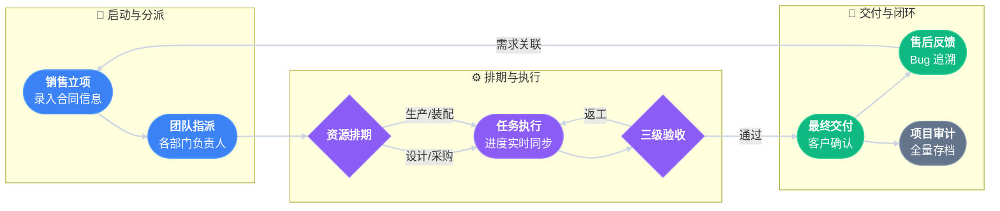
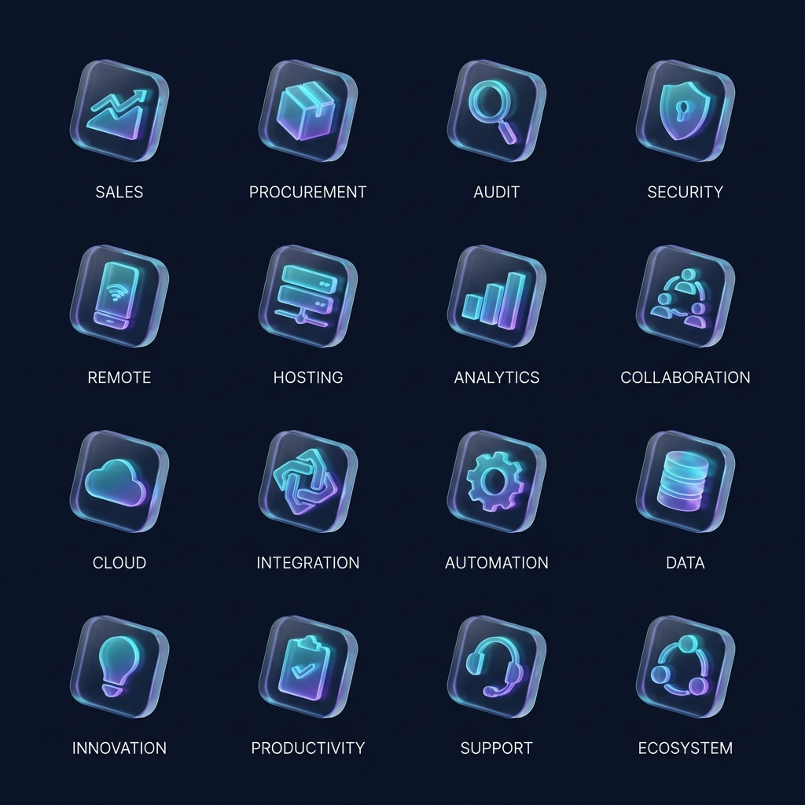
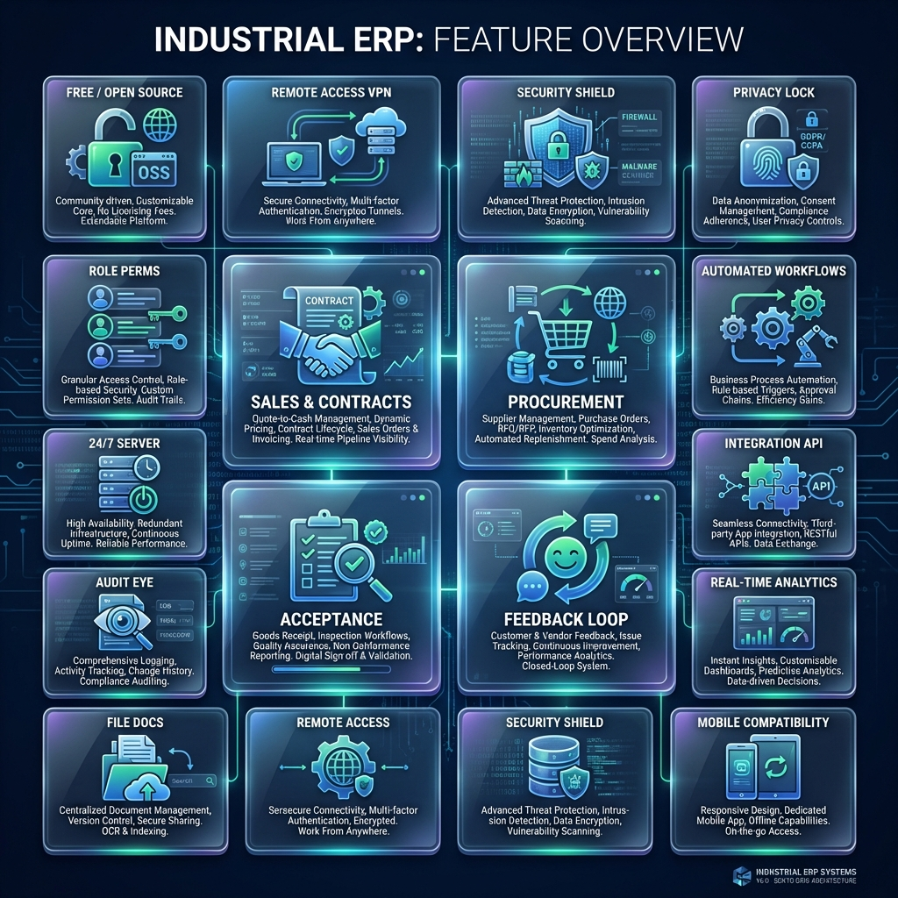
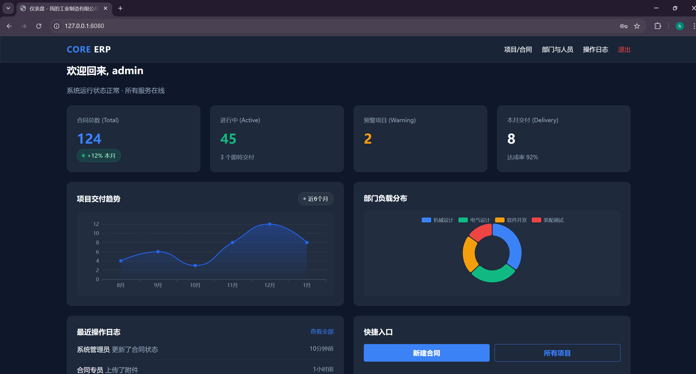

# CORE ERP v3.0.0 — 开源工业流程管理系统


> **一键安装，局域网即用** — 专为中小型制造企业设计的现代化 ERP 系统。

基于 Python Flask 打造，采用 Glassmorphism 玻璃拟态 UI 设计，**核心聚焦以下企业级价值点**：

1.  **🖥️ 一键安装部署**: Windows 一键安装包，双击即用。内置 Python 运行时、SQLite 数据库、NSSM 服务管理，**零依赖、零配置**。
2.  **🌍 零成本异地办公**: 提供完整的 **Tailscale / FRP / 云服务器** 三种远程访问方案，无需公网 IP 也能安全远程访问。
3.  **🛡️ 严密的权限分层**: 实现了 **管理员-老板-部门负责人-员工-客户** 五级权限隔离，支持邀请码注册机制。
4.  **💬 多通道消息通知**: 集成 **企业微信、钉钉、邮件及手机短信** 为一体的通知后端，关键节点手动自选通知方式指定提醒负责人。
5.  **📂 结构化文件管理**: 文件按 **"合同编号"** 自动归档隔离，确保不同项目资料清晰有序，互不干扰。
6.  **📄 实时文档引擎**: 内置 Office/PDF/图片 预览引擎，图纸与技术文档无需下载，在线即阅。
7.  **👥 灵活的团队管理**: 合同生命周期中的**工作人员可自由增减**，人员档案（姓名、邮箱、联系方式）自动对应通知后端。
8.  **📜 全程操作审计**: 后台完整记录所有人员的 **操作日志**，每一项改动均可回溯，保障系统安全。
9.  **📊 全流程闭环**: 涵盖从合同生命周期到**精准的工期管理**，再到生产任务追踪与组织架构管理的完整数据闭环。

### 📖 详细功能演示请查看 [USER_GUIDE.md](USER_GUIDE.md) 或 [USER_GUIDE_EN.md](USER_GUIDE_EN.md)。

---

## 🚀 快速开始（3 分钟上手）

### 方式一：一键安装（推荐 · 普通用户）

适合没有技术背景的管理者，全程无需接触代码。

1. **下载** `CoreERP-Setup-v3.0.0.exe` 安装包
2. **双击运行**，UAC 弹窗点击「是」
3. **按提示安装**（默认安装到 `C:\CoreERP`），约 30 秒完成
4. **浏览器自动打开**，进入设置向导：
   - Step 1：填写公司名称
   - Step 2：创建管理员账号和密码
   - Step 3：完成！进入系统仪表盘
5. **告诉员工局域网地址**（启动时控制台会显示，如 `http://192.168.1.100:8000`）

> **安装后自动完成的事情**：
> - ✅ CORE ERP 注册为 Windows 服务，开机自动启动
> - ✅ 防火墙自动放行 8000 端口，局域网内其他设备可直接访问
> - ✅ 桌面创建快捷方式，双击即可打开浏览器

### 方式二：源码运行（开发者 · 二次开发）

适合有 Python 开发经验，需要自定义功能的技术人员。

```bash
# 1. 克隆仓库
git clone https://github.com/fortitudelucifer/erp_opensource.git
cd erp_opensource

# 2. 创建虚拟环境并安装依赖
python -m venv venv
venv\Scripts\activate        # Windows
pip install -r requirements.txt

# 3. 启动开发服务器
python run.py

# 4. 访问 http://127.0.0.1:8000，首次打开会进入设置向导
```

> **说明**：源码运行默认使用 SQLite 数据库（`data/erp.db`），零配置。如需使用 SQL Server 或 PostgreSQL，请修改 `config.py` 中的 `SQLALCHEMY_DATABASE_URI`。

---

## 🔄 核心工作流 (Standard Workflow)



```mermaid
graph LR
    %% 全局样式定义
    classDef start fill:#3b82f6,stroke:#60a5fa,color:#fff;
    classDef core fill:#8b5cf6,stroke:#a78bfa,color:#fff;
    classDef sync fill:#10b981,stroke:#34d399,color:#fff;
    classDef archive fill:#64748b,stroke:#94a3b8,color:#fff;

    subgraph PHASE1 ["🏁 启动与分派"]
        A(["<b>销售立项</b><br/>录入合同信息"])
        B(["<b>团队指派</b><br/>各部门负责人"])
    end

    subgraph PHASE2 ["⚙️ 排期与执行"]
        C{"<b>资源排期</b>"}
        D(["<b>任务执行</b><br/>进度实时同步"])
        E{"<b>三级验收</b>"}
    end

    subgraph PHASE3 ["🚀 交付与闭环"]
        F(["<b>最终交付</b><br/>客户确认"])
        G(["<b>售后反馈</b><br/>Bug 追溯"])
        H(["<b>项目审计</b><br/>全量存档"])
    end

    %% 业务流转
    A --> B
    B --> C
    C -->|设计/采购| D
    C -->|生产/装配| D
    D --> E
    E -->|通过| F
    E -->|返工| D
    F --> G
    G -->|需求关联| A
    F --> H

    %% 应用样式
    class A,B start;
    class C,D,E core;
    class F,G sync;
    class H archive;

    %% 连线美化
    linkStyle default stroke-width:2px,stroke:#cbd5e1,fill:none;
```

### 详细步骤说明

1.  **立项 (Create)**:
    - 销售人员创建新合同，填写交期、合同编号、项目总负责人、客户信息等。
    - 系统生成唯一的项目编号。

2.  **分派 (Assign)**:
    - 管理员为项目指定不同部门的负责人 (Feature Leader)。
    - 指定各部门相应负责人收到通知。

3.  **排期 (Plan)**:
    - 录入具体的生产任务 (Tasks)，设定起止时间和相应内容。
    - 自动生成甘特图。
    - 各部门负责人可随时查看本部门任务进度，并可手动指定提醒。

4.  **执行 (Execute)**:
    - 员工更新任务进度 (0% -> 100%)。
    - 如需采购，录入采购清单，追踪到货情况。
    - 各部门负责人可随时查看本部门任务进度，并可手动指定提醒。

5.  **验收 (Accept)**:
    - 任务完成后发起验收申请。
    - 质检人员标记验收由"审核中"变更为"通过"或"驳回"。

6.  **交付与售后 (Deliver & Feedback)**:
    - 记录最终交付时间。
    - 记录客户反馈（Bug/需求），并关联回具体项目进行迭代。

7.  **项目存档 (Archive)**:
    - 项目完成后，将项目存档。
    - 项目情况可筛选、查询和追溯。

---

## 🚀 核心特色 (Unique Features)



### 1. 工业美学看板 (Bento Grid Dashboard)



放弃了传统的表格堆砌，采用 Bento Grid 风格的仪表盘。

- **多维状态可视化**: 采用六色光效语义化展示项目状态，一眼即识：
  - 🟣 **生产中 (Production)**: 紫色脉冲，代表核心制造环节。
  - 🔵 **进行中 (Processing)**: 蓝色高亮，代表常规任务推进。
  - 🟠 **验收/问题 (Issue)**: 橙色警示，代表等待验收或存在反馈。
  - 🟢 **已验收 (Accepted)**: 绿色完成，代表交付无误。
  - 🔘 **未启动 (Unstarted)**: 灰色静默，代表立项待办。
  - 🔴 **延误 (Risk)**: 红色高亮 (在甘特图中体现)，代表进度逾期。
- **关键指标**: 首页直观呈现"进行中合同"、"待办任务"、"本月交付"等核心 KPI。

### 2. 动态甘特图 (Interactive Gantt Chart)

内置 Frappe Gantt 引擎，自动根据任务起止时间生成动态时间轴。

- 支持拖拽查看进度。
- 自动计算并高亮今日任务。
- 以天/周/月多维度视图展示项目全貌。

> **合同签订** ➔ **任务下达** ➔ **生产/采购** ➔ **内部验收** ➔ **客户交付** ➔ **售后反馈**

### 3. 企业级权限与安全边界 (RBAC & Security)


并非简单的登录验证，系统实现了严密的**角色分层与数据隔离**：

- **管理员 (Admin)**: 系统最高权限，管理用户账号、配置系统、查看所有数据。
- **老板 (Boss)**: 上帝视角，查看所有项目、财务及员工绩效。
- **部门负责人 (Leader)**: 仅能管理本部门负责的项目任务与人员。
- **普通员工 (Staff)**: 只能访问自己参与的任务和被授权的文件。
- **客户 (Customer)**: 只能查看与自己公司相关的合同进度，绝对隔离。

### 4. 实时文档预览引擎 (Document Preview)

内置强大的文件处理引擎，让 ERP 成为企业的知识库。无需下载，直接在浏览器中预览：

- **办公文档**: 支持 Word (`.docx`), Excel (`.xlsx`), PPT (`.pptx`)。
- **专业格式**: 支持 PDF 和各类高清图片。
- **底层技术**: 采用 LibreOffice 转换服务与 PDF.js 渲染，流畅且兼容性强。

### 5. 结构化文件系统 (Isolated File System)

系统对附件存储进行了深度优化，确保资料管理的严谨性：

- **合同对齐**: 所有上传的文件均严格挂载在对应"合同编号"的文件目录下。
- **物理隔离**: 不同合同的文件在服务器存储层级即是不相通的，从根源上避免了资料混淆。
- **版本管理**: 支持对同一文件进行版本迭代，保留历史版本，防止误覆盖。

### 6. 全量操作审计 (Operation Audit Logs)


系统自带"黑匣子"功能，记录系统内发生的一切重要行为：

- **谁在干什么**: 精确记录操作人、操作时间、IP地址以及具体的改动内容（包含修改前后的值对比）。
- **回溯追踪**: 管理员可在后台通过日期、项目、人员多维度检索审计日志。
- **安全保障**: 为企业提供完整的数据变动链条，是内部风控和责任追溯的利器。

### 7. 多通道消息通知 (Multi-channel Notification)

系统内置了模块化的通知后端，支持以下通道：

- **企业微信 / 钉钉**: 通过群机器人同步项目关键变动（如任务下达、合同逾期）。
- **邮件服务**: 发送正式的业务提醒和报表。
- **手机短信**: 针对高优先级催办事件，确保信息及时送达。
- **配置**: 在系统「设置 → 基本设置」页面配置相应的 Token/API 即可。

### 8. 柔性团队管理 (Flexible Staffing)


针对制造业项目人员变动频繁、协作复杂的特点，系统提供了一套结构化的团队管理方案：

- **结构化档案**: 支持为每位团队成员维护详细档案，包括**姓名、个人邮箱、手机号码**、微信号以及所属部门等关键信息。
- **自动映射通知**: 核心优势在于档案与通知系统的**自动映射关联**。一旦在项目中指派了负责人，系统会自动调取其档案中的联系方式，通过邮件、短信或企业微信进行精准触达。
- **自由增减**: 在"项目详情-负责人管理"中，可随时为每个部门增加或移除协助负责人，动态适配项目规模。
- **权限联动**: 权限随人员进出项目实时更新，无需手动重置账号权限，确保数据安全。

---

## 🌍 远程访问方案


系统内置了三种互联网远程访问方案的详细教程（位于「设置 → 远程访问」页面）：

| 方案 | 适合场景 | 难度 | 成本 |
|------|---------|------|------|
| **Tailscale（推荐）** | 小团队，偶尔远程 | ⭐ 简单 | 免费 |
| **FRP 内网穿透** | 有技术人员，需固定地址对外服务 | ⭐⭐⭐ 中等 | 需云服务器 ¥50-100/月 |
| **云服务器部署** | 稳定长期运营，多人远程 | ⭐⭐⭐⭐ 较难 | ¥100-300/月 |

### Tailscale 快速上手

1. 在 [tailscale.com](https://tailscale.com/) 注册账号（推荐用微软账号登录）
2. 在 ERP 服务器电脑和远程设备上都安装 Tailscale 客户端
3. 用同一账号登录，通过分配的 `100.x.x.x` 地址访问 ERP

> 详细的 FRP 和云服务器方案教程已内置在系统设置页面中。

---

## ❓ 常见问题 (Troubleshooting)

**Q1: 安装时弹出「拒绝访问」错误?**

- **原因**: 安装需要管理员权限。
- **解决**: 右键安装包 → 「以管理员身份运行」。

**Q2: 局域网内其他电脑无法访问?**

- **检查**: 确认两台电脑在同一局域网（同一 WiFi 或有线网络）。
- **解决**: 检查 Windows 防火墙是否放行了 8000 端口（安装包会自动配置，但手动安装的防火墙软件可能拦截）。

**Q3: 忘记管理员密码怎么办?**

- **解决**: 删除 `C:\CoreERP\data\erp.db` 和 `C:\CoreERP\data\config.json`，重启服务后会重新进入设置向导。
- ⚠️ **注意**: 这会清除所有数据，请提前备份 `data` 文件夹。

**Q4: 如何备份数据?**

- 定期复制 `C:\CoreERP\data\` 文件夹到U盘或网盘即可。核心数据文件为 `data/erp.db`。

**Q5: 如何更新到新版本?**

- 先备份 `data` 文件夹 → 下载新版安装包 → 覆盖安装到相同目录 → 数据自动保留。

**Q6: 端口 8000 被占用?**

- **检查**: `netstat -ano | findstr :8000` 查看占用进程。
- **解决**: 修改 `launcher.py` 中的 `--port` 参数，或关闭占用端口的程序。

**Q7: 启动时报错 `Non-UTF-8 code`? (开发者)**

- **解决**: 在 VSCode 中将报错文件编码转换为 **UTF-8 without BOM**。

---

## ⚙️ 二次开发/定制指南 (Customization)

本系统针对制造业场景预设了部分逻辑，您可根据实际需求轻松修改：

### 1. 修改角色 (Roles)

系统目前的角色权限（如 `admin`, `boss`, `sales`）映射逻辑位于：

- **文件**: `core/contracts.py`
- **函数**: `normalize_role()`
- **说明**: 您可以在字典中添加新的角色映射（如 `"质检员": "qc"`），并在 `auth.py` 中扩展相应的权限装饰器。

### 2. 修改部门 (Departments)

部门数据存储在数据库 `department` 表中。

- **默认**: 采购部、销售部、机械部、电气部、软件部、调试装配部。
- **修改**: 直接操作数据库，或编写 Python 脚本调用 `db.session.add(Department(name="新部门"))` 进行初始化。

### 3. 修改文件类型 (File Types)

文件类型（合同、技术文档、图纸、其它）的下拉选项位于前端模板中：

- **文件**: `core/templates/contracts/files.html`
- **位置**: 搜索 `<select name="file_type">`
- **修改**: 直接在 HTML 中增删 `<option>` 标签即可。

### 4. 更多硬编码修改

- **`config.py`**（开发模式）: 数据库URI、密钥、品牌名称等配置项。通知 Token/API 请在系统「设置 → 基本设置」页面操作，无需直接修改代码。

---

## 📂 项目结构说明 (File Structure)

```text
erp_opensource/
├── config.py                # [配置中心] 数据库URI、密钥、品牌名称等（开发模式）
├── run.py                   # [开发入口] python run.py 本地运行 (端口 8000)
├── wsgi.py                  # [部署入口] 配合 Waitress/Gunicorn 的生产环境接口
├── launcher.py              # [服务入口] 安装包使用的启动器，管理服务生命周期
├── requirements.txt         # [依赖清单] Flask, SQLAlchemy, Waitress 等
│
├── installer/               # [安装包构建]
│   ├── build.py             #   构建脚本：打包 Python + 依赖 + 源码
│   ├── core_erp.iss         #   Inno Setup 安装脚本
│   ├── requirements_build.txt  # 构建专用依赖
│   └── downloads/           #   Python Embedded / NSSM 缓存
│
├── data/                    # [运行时数据]（安装后自动生成）
│   ├── erp.db               #   SQLite 数据库（所有业务数据）
│   ├── config.json          #   系统配置（公司名、邀请码等）
│   ├── uploads/             #   上传文件存储
│   └── service.log          #   服务运行日志
│
└── core/                    # [核心应用包]
    ├── __init__.py          #   应用工厂：注册蓝图、数据库、权限控制
    ├── models.py            #   数据模型：User, Contract, Task 等
    ├── auth.py              #   认证鉴权：登录/注册/邀请码验证
    ├── contracts.py         #   业务主逻辑：合同/项目/任务管理
    ├── org.py               #   组织架构：部门与人员 CRUD
    ├── logs.py              #   审计中心：操作日志展示与查询
    ├── operation_log.py     #   日志记录模块
    ├── setup_wizard.py      #   [v3 新增] 首次启动设置向导
    ├── settings.py          #   [v3 新增] 系统设置（公司/远程/系统信息）
    ├── user_mgmt.py         #   [v3 新增] 用户管理（CRUD + 角色分配）
    ├── help.py              #   [v3 新增] 帮助中心 FAQ
    │
    ├── services/            #   [服务层] 复杂业务逻辑
    │   ├── production_service.py
    │   ├── procurement_service.py
    │   ├── acceptance_service.py
    │   ├── feedback_service.py
    │   ├── file_service.py
    │   ├── preview_service.py
    │   ├── notification_service.py
    │   └── common_utils.py
    │
    ├── static/              #   [静态资源]
    │   ├── css/             #     theme.css, components.css (Glassmorphism 样式)
    │   ├── js/              #     main.js (交互脚本)
    │   └── img/             #     logo.svg (品牌 Logo)
    │
    └── templates/           #   [视图层] Jinja2 模板
        ├── base.html        #     全局布局：导航栏、Logo、响应式容器
        ├── home.html        #     仪表盘：Bento Grid + 首次登录引导卡片
        ├── auth/            #     登录/注册 (Logo + 渐变背景动效)
        ├── contracts/       #     项目详情、任务看板、甘特图、文件库
        ├── admin/           #     [v3 新增] 系统设置、用户管理
        ├── setup/           #     [v3 新增] 设置向导 3 步流程
        ├── help/            #     [v3 新增] 帮助中心 FAQ
        ├── logs/            #     操作日志查询
        └── org/             #     部门与人员管理
```

---

## 📸 系统截图与功能演示 (Screenshots & Guide)

> 📖 **[点击查看完整功能演示手册 (USER_GUIDE.md)](USER_GUIDE.md)**
> 本手册收录了 **设置向导、仪表盘、项目管理、用户管理、帮助中心** 等全模块的界面演示。



---

## 📄 开源协议 (License)

本项目采用 **Apache License 2.0** 协议进行开源。

这意味着您可以：

- ✅ **商业使用**: 免费将本系统用于商业闭源产品。
- ✅ **任意修改**: 自由修改代码以适配您的业务需求。
- ✅ **分发**: 复制并分发本项目的副本。

但您需要遵守以下义务（即"署名"）：

- ⚠️ **必须保留版权声明**: 在所有副本或其衍生品中，必须保留原始的 LICENSE 文件与版权声明。
- ⚠️ **显著声明修改**: 如果您修改了文件，需要进行说明。

## 🤝 贡献与安全 (Contribution & Security)

作者非常欢迎社区的参与！

- **想参与开发？** 请阅读 [贡献指南 (CONTRIBUTING.md)](CONTRIBUTING.md) 了解如何提交 Issue 和 Pull Request。
- **发现安全漏洞？** 请参阅 [安全策略 (SECURITY.md)](SECURITY.md) 了解如何负责任地报告安全问题。

---

## 👨‍💻 作者与支持 (Author)

- **作者**: [fortitudelucifer](https://github.com/fortitudelucifer)
- **GitHub**: [https://github.com/fortitudelucifer](https://github.com/fortitudelucifer)
- **说明**: 欢迎在 GitHub 提交 Issue 或 Pull Request，共同完善这个现代化工业 ERP 框架。
