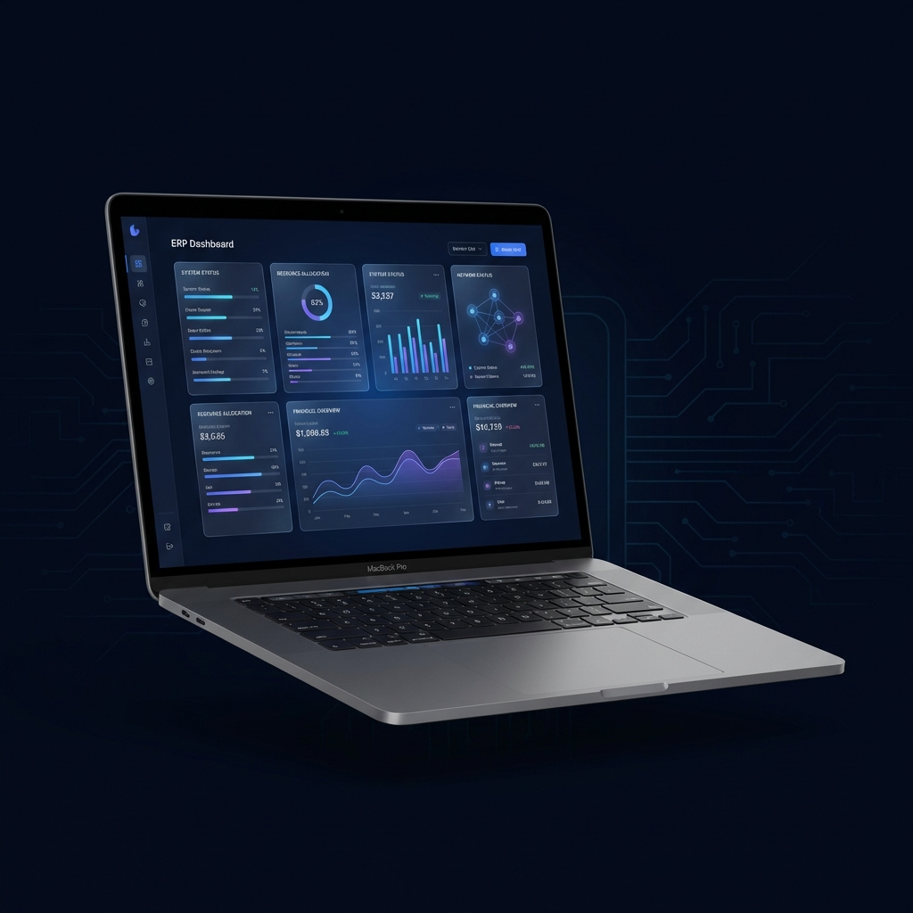
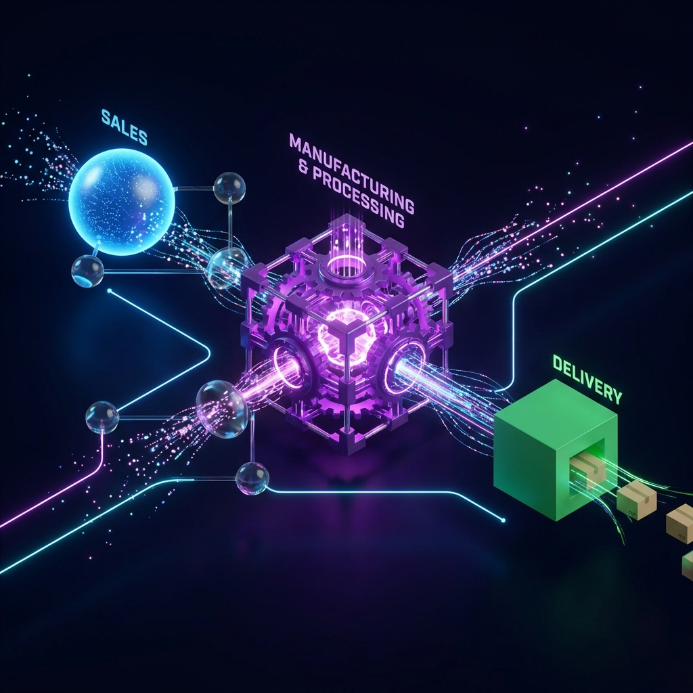
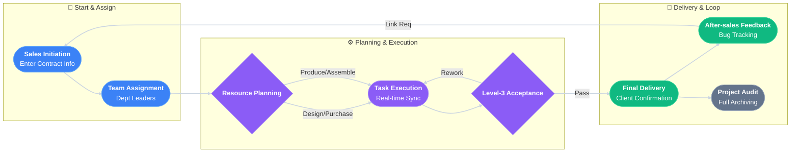
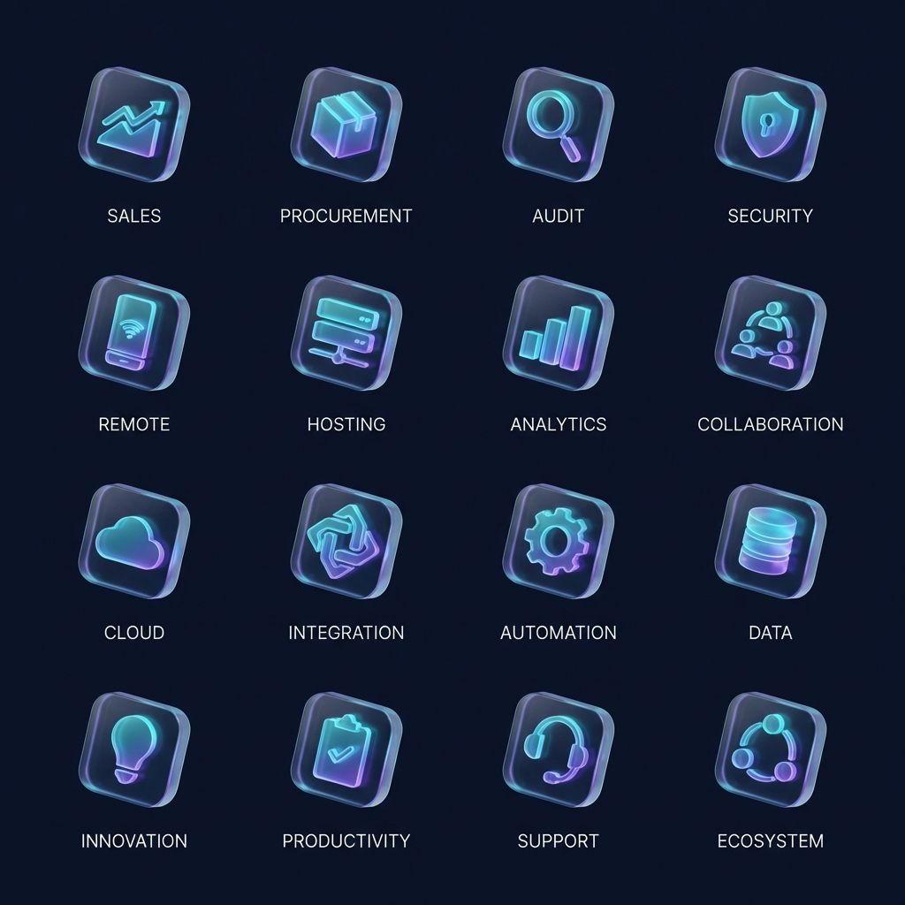
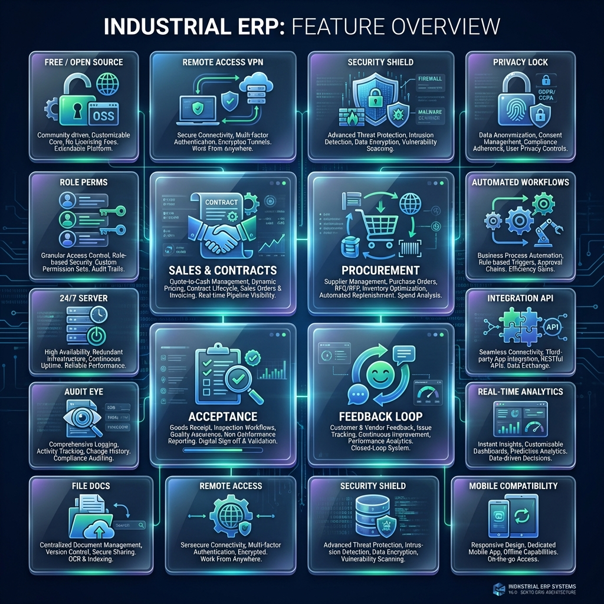
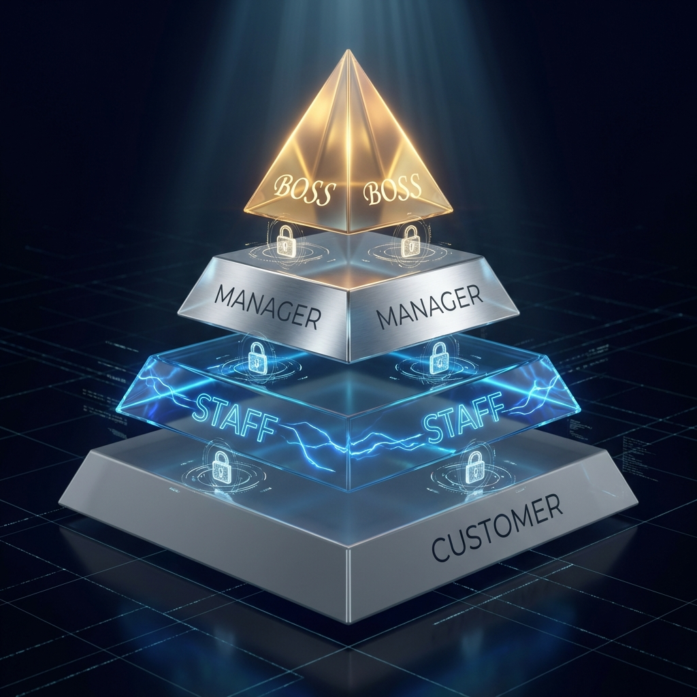
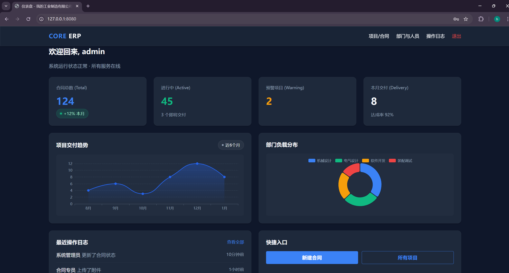
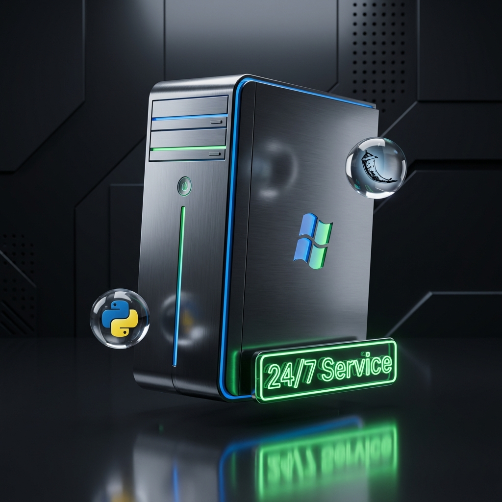

# Industrial Flow ERP System (Open Source Edition)



This is a modern industrial process management system built with Python Flask, designed specifically for small and medium-sized manufacturing enterprises (SMBs). Compared to generic ERPs on the market, this project **focuses on the following enterprise-grade values**:

1.  **🌍 Zero-Cost Remote Office**: Provides a complete **"Intranet Deployment + Tailscale Private Tunnel"** free solution. Use it on the intranet or remotely without a public IP, ensuring secure access from anywhere.
2.  **🛡️ Strict Permission Layering**: Implements a four-level permission isolation of **Boss-Department Leader-Staff-Client** to ensure data security boundaries.
3.  **💬 Multi-Channel Notifications**: Integrates **WeCom, DingTalk, Email, and SMS** into a unified notification backend. Critical nodes can be manually configured to notify specific responsible persons.
4.  **📂 Structured File Management**: Files are automatically archived and isolated by **"Contract Number"** to ensure project materials are organized and do not interfere with each other.
5.  **📄 Real-Time Document Engine**: Built-in Office/PDF/Image preview engine allows drawings and technical documents to be viewed online without downloading.
6.  **👥 Flexible Team Management**: **Staff can be freely added or removed** during the contract lifecycle, and personnel profiles (name, email, contact info) utilize the notification backend automatically.
7.  **📜 Full Operation Audit**: The background records **operation logs** of all personnel. Every change can be traced back to ensure system security.
8.  **📊 Full Process Closed Loop**: Covers the complete data loop from Contract Lifecycle to **Precise Schedule Management**, Production Task Tracking, and Organizational Architecture Management.
9.  **🖥️ Windows Production Hosting**: Supports **NSSM + Waitress** hosting mode, achieving boot start and 24-hour unattended operation, ensuring the system remains stable in a Windows environment. **Deploy on just one machine for the whole team to use.** The system is also compatible with Linux environments.

## 🔄 Standard Workflow





### Detailed Steps

1.  **Create**:
    - Sales personnel create a new contract, filling in delivery date, contract number, project leader, client info, etc.
    - The system generates a unique project code.

2.  **Assign**:
    - Administrators assign Feature Leaders for different departments to the project.
    - Designated department leaders receive notifications.

3.  **Plan**:
    - Enter specific production Tasks, setting start/end times and content.
    - Automatically generate Gantt charts.
    - Department leaders can view their department's task progress anytime and manually set reminders.

4.  **Execute**:
    - Staff update task progress (0% -> 100%).
    - If procurement is needed, enter the procurement list and track arrival status.
    - Department leaders can view task progress and set reminders.

5.  **Accept**:
    - Initiate acceptance application after task completion.
    - QC personnel mark acceptance from "Under Review" to "Passed" or "Rejected".

6.  **Deliver & Feedback**:
    - Record final delivery time.
    - Record client feedback (Bugs/Requirements) and link back to specific projects for iteration.

7.  **Archive**:
    - Archive the project upon completion.
    - Project details can be filtered, queried, and traced.

## 🚀 Unique Features



### 1. Industrial Aesthetic Dashboard (Bento Grid)



Abandoning traditional table stacking, we adopted a Bento Grid style dashboard.

- **Multi-dimensional Visual Status**: Uses six-color light effects to semantically display project status:
  - 🟣 **Production**: Purple pulse, representing core manufacturing processes.
  - 🔵 **Processing**: Blue highlight, representing routine task progress.
  - 🟠 **Issue**: Orange warning, representing pending acceptance or feedback.
  - 🟢 **Accepted**: Green completion, representing error-free delivery.
  - 🔘 **Unstarted**: Grey silence, representing pending initiation.
  - 🔴 **Risk**: Red highlight (shown in Gantt chart), representing overdue progress.
- **Key Metrics**: The homepage intuitively presents core KPIs like "Active Contracts", "Pending Tasks", "Delivery This Month".

### 2. Interactive Gantt Chart

Built-in Frappe Gantt engine automatically generates dynamic timelines based on task start/end times.

- Supports drag-and-drop to view progress.
- Automatically calculates and highlights today's tasks.
- Displays the full project picture in Day/Week/Month views.

> **Contract Signed** ➔ **Task Issued** ➔ **Production/Procurement** ➔ **Internal Acceptance** ➔ **Client Delivery** ➔ **After-sales Feedback**

### 3. Enterprise RBAC & Security Boundaries



Not just simple login verification, the system implements strict **Role Layering and Data Isolation**:

- **Boss**: God view, view all projects, finance, and employee performance.
- **Leader**: Can only manage project tasks and personnel for their own department.
- **Staff**: Can only access tasks they participate in and authorized files.
- **Customer**: Can only view progress of contracts related to their own company, absolutely isolated.

### 4. Real-time Document Preview Engine

Built-in powerful file processing engine turns the ERP into an enterprise knowledge base. Preview directly in the browser without downloading:

- **Office Docs**: Supports Word (`.docx`), Excel (`.xlsx`), PPT (`.pptx`).
- **Pro Formats**: Supports PDF and various high-def images.
- **Underlying Tech**: Uses LibreOffice conversion service and PDF.js rendering, smooth and highly compatible.

### 5. Structured (Isolated) File System

The system has deeply optimized attachment storage to ensure rigorous data management:

- **Contract Alignment**: All uploaded files are strictly mounted under the corresponding "Contract Number" directory.
- **Physical Isolation**: Files of different contracts are unconnected at the server storage level, preventing data confusion at the source.
- **Version Management**: Supports version iteration for the same file, retaining historical versions to prevent accidental overwrites.

### 6. Full Operation Audit Logs


The system comes with a "Black Box" function that records every important action within the system:

- **Who did What**: Precisely records the operator, operation time, IP address, and specific changes (including value comparison before and after modification).
- **Traceability**: Administrators can retrieve audit logs by date, project, or personnel in the background.
- **Security Guarantee**: Provides a complete data change chain for the enterprise, a tool for internal risk control and responsibility tracing.

### 7. Multi-channel Notification

The system has a built-in modular notification backend supporting the following channels:

- **WeCom / DingTalk**: Sync critical project changes (e.g., task assignment, contract overdue) via group robots.
- **Email Service**: Send formal business reminders and reports.
- **SMS**: For high-priority urgent events, ensuring messages are delivered in time.
- **Configuration**: Select `NOTIFICATION_BACKEND` in `config.py` and configure the corresponding Token/API.

### 8. Flexible Team Management


Addressing the frequent personnel changes and complex collaboration in manufacturing, the system provides a structured team management scheme:

- **Structured Profiles**: Supports detailed profiles for each team member, including **Name, Personal Email, Phone Number**, WeChat ID, and Department.
- **Auto-Mapping Notifications**: The core advantage lies in the **automatic mapping** between profiles and the notification system. Once a person is assigned as a leader in a project, the system automatically retrieves contact info from their profile to reach them accurately via Email, SMS, or WeCom.
- **Free Addition/Removal**: In "Project Details - Leader Management", you can add or remove assisting leaders for each department at any time, dynamically adapting to project scale.
- **Permission Linkage**: Permissions update in real-time as personnel enter or leave projects, without manually resetting account permissions, guaranteeing data security.

## 🛠️ Installation & Usage

### 1. Prerequisites

- Python 3.8+
- SQL Server (Recommended) or other databases supported by SQLAlchemy

#### Virtual Environment Example (Windows)

```cmd
D:\code> mkdir your_erp
D:\code> cd your_erp
D:\code\your_erp> py -3 -m venv your_erp_preferred
D:\code\your_erp> venv\Scripts\activate
```

### 2. Install SQL Server 2022 Developer (Quick Guide)

If you don't have a local database, we recommend the free Developer edition:

1.  **Download**: Search "SQL Server 2022 Developer" and download from Microsoft official site.
2.  **Install**: Run the installer and select **"Basic"** installation.
3.  **Tools**: After installation, click **"Install SSMS"** (SQL Server Management Studio) for graphical database management.
    ps: **Installation Reference**: https://www.bilibili.com/video/BV13o4y1V7Jb?spm_id_from=333.788.videopod.episodes&vd_source=d49e0c134bc6c6180dab2a3de3c221f0

### 3. Install Dependencies

```bash
pip install -r requirements.txt
```

### 4. Configuration

```bash
cp config.example.py config.py
# Remember to modify database connection and COMPANY_NAME in config.py
```

## ⚙️ Customization Guide

The system presets some logic for manufacturing scenarios, which you can easily modify according to actual needs:

### 1. Modify Roles

Current role permission mapping logic (e.g., `admin`, `boss`, `sales`) is located in:

- **File**: `core/contracts.py`
- **Function**: `normalize_role()`
- **Note**: You can add new role mappings (e.g., `"Inspector": "qc"`) in the dictionary and extend corresponding permission decorators in `auth.py`.

### 2. Modify Departments

Department data is stored in the `department` table in the database.

- **Default**: Purchasing, Sales, Mechanical, Electrical, Software, Assembly.
- **Modify**: Operate directly on the database, or write a Python script calling `db.session.add(Department(name="New Dept"))` to initialize.

### 3. Modify File Types

File type dropdown options (Contract, Tech Doc, Drawing, Others) are in the frontend template:

- **File**: `core/templates/contracts/files.html`
- **Location**: Search `<select name="file_type">`
- **Modify**: Directly add/delete `<option>` tags in HTML.

### 4. More Hardcoded Modifications

- **`config.example.py`**: The example config here is desensitized. In actual deployment, please search for global `APP_` variables in the code to ensure consistency with your environment variables.

## 📸 Screenshots & Guide

> 📖 **[Click to view full System User Guide (USER_GUIDE_EN.md)](USER_GUIDE_EN.md)**  
> This manual includes real interface demos of **Dashboard, Project Management, Task Scheduling, Supply Chain, Organizational Architecture**, etc.



We recommend using SQL Server Management Studio (SSMS) to execute the following script for quick database creation:

```sql
-- 1. Create Database
CREATE DATABASE YOUR_DATABASE_NAME;
GO

-- 2. Create Login
CREATE LOGIN YOUR_USERNAME WITH PASSWORD = 'YOUR_STRONG_PASSWORD!';
GO

-- 3. Grant Permissions
USE YOUR_DATABASE_NAME;
GO
CREATE USER YOUR_USERNAME FOR LOGIN YOUR_USERNAME;
GO
ALTER ROLE db_owner ADD MEMBER YOUR_USERNAME;
GO
```

_(SQLAlchemy will automatically create table structures after running `python run.py`)_

### 6. Start Running

```bash
python run.py
```

### 7. Run & Test

- **Activate Env**: Confirm virtual environment is activated (line starts with `(venv)` or your env name).
- **Start Command**: Run in project root: `(venv) D:\code\your_erp> python run.py`
- **Access**: Open browser: [http://127.0.0.1:8000/](http://127.0.0.1:8000/) (Default port 8000, system adapted).

### 8. Production Deployment



- **Windows**: Recommended to use **NSSM** (Non-Sucking Service Manager) to host Waitress as a system background service, achieving boot start and 24-hour unattended operation without keeping the command window open.
- **Linux**: This project supports Linux environments, but specific daemon configurations (like Systemd + Gunicorn) need to be explored and configured based on your server environment.

## 🌍 Zero-Cost Enterprise Remote Access Scheme


This system provides a **"Intranet Deployment + Private Tunnel"** free remote office solution, balancing absolute data privacy and convenience of remote access:

1.  **Data Security**: Database and application are deployed on the company intranet server, physically isolated, exposing no public ports, with no scanning risk.
2.  **Private Tunnel (Tailscale)**: Uses WireGuard protocol to build point-to-point encrypted tunnels.
    - Employees working from home can turn on Tailscale to access ERP at LAN speeds.
    - **Completely Free**: Free for small teams (< 3 users / 100 devices), perfectly fitting the target users of this system.
3.  **Configuration Method**:
    - Fill in the machine domain name assigned by Tailscale (`APP_BASE_URL`) in `config.py`.
    - The system will automatically identify and adapt the jump logic during remote access.

## ❓ Troubleshooting

**Q1: `Non-UTF-8 code` error on startup?**

- **Cause**: Windows Visual Studio sometimes saves files in GBK encoding by default.
- **Solution**: Convert all `html/py` file encodings to **"UTF-8 without BOM"** in VSCode/Editor.

**Q2: `socket access permission denied` or port occupied?**

- **Check**: Type `netsh int ipv4 show excludedportrange protocol=tcp` to view system reserved ports.
- **Solution**: Modify `run.py` to change port (e.g., 5000 -> 8000), or restart computer to release ports.

**Q3: SQL Server connection failed?**

- **Solution**: Open **SQL Server Configuration Manager** -> Network Configuration -> Enable **TCP/IP** and **Named Pipes**, then restart SQL Server service.

## 📂 File Structure

```text
erp_opensource/
├── config.py                # [Config Center] DB URI, Keys, Brand Name, Notification Tokens, etc.
├── run.py                   # [Dev Entry] python run.py to run locally (Port 8000)
├── wsgi.py                  # [Deploy Entry] Production interface for Gunicorn or IIS/Waitress
├── requirements.txt         # [Dependencies] Flask, SQLAlchemy, pyodbc, etc.
│
└── core/                    # [Core App Package]
    ├── __init__.py          # App Factory: Register Blueprints, Config DB, Mount Filters
    ├── models.py            # [Data Models] User, Contract, Task DB Tables
    ├── auth.py              # [Auth] Login logic, Permission decorators (@staff_required)
    ├── org.py               # [Org] Dept & Personnel CRUD & Permission Mapping
    ├── contracts.py         # [Business Logic] Contract List, Details, Assignment, Status Flow
    ├── logs.py              # [Audit] Operation Log Display & Query
    ├── operation_log.py     # Log Recording Module, saves all changes to DB
    │
    ├── services/            # [Service Layer] Complex Logic Decoupling
    │   ├── production_service.py   # Production Task Status Control
    │   ├── procurement_service.py  # Procurement Logic
    │   ├── acceptance_service.py   # Acceptance Process State Machine
    │   ├── feedback_service.py     # After-sales Feedback Logic
    │   ├── file_service.py         # File Upload, Versioning, Permission Check
    │   ├── preview_service.py      # Doc Conversion Engine (LibreOffice -> PDF)
    │   ├── notification_service.py # Notification Adapters (DingTalk/WeCom/Email)
    │   └── common_utils.py         # Config Validation & Utils
    │
    ├── static/              # [Static Assets]
    │   ├── css/ (components.css, theme.css - Glassmorphism styles)
    │   ├── js/ (main.js - Page interactions)
    │   └── img/
    │
    └── templates/           # [View Layer] Jinja2 Templates
        ├── base.html        # Global Base: Sidebar, Topbar, Flash Messages
        ├── home.html        # Dashboard: Bento Grid KPI Cards & Charts
        ├── auth/            # Auth Pages: Login, Register
        ├── contracts/       # Business Pages: Project Details, Kanji, Gantt, Files
        ├── logs/            # Audit Logs
        └── org/             # Org Pages: Personnel & Dept Management
```

## 📄 License

This project is licensed under the **Apache License 2.0**.

This means you can:

- ✅ **Commercial Use**: Freely use this system for commercial closed-source products.
- ✅ **Modify**: Freely modify code to adapt to your business needs.
- ✅ **Distribute**: Copy and distribute copies of this project.

But you must comply with the following obligations (i.e. "Attribution"):

- ⚠️ **Keep Copyright Notice**: You must retain the original LICENSE file and copyright notice in all copies or derivatives.
- ⚠️ **State Changes**: If you modify files, you need to state so.

## 🤝 Contribution & Security

Authors welcome community participation!

- **Want to Contribute?** Please read [Contributing Guide (CONTRIBUTING_EN.md)](CONTRIBUTING_EN.md) to learn how to submit Issues and Pull Requests.
- **Found a Security Vulnerability?** Please refer to [Security Policy (SECURITY.md)](SECURITY.md) to learn how to responsibly report security issues.

---

## 👨‍💻 Author

- **Author**: [fortitudelucifer](https://github.com/fortitudelucifer)
- **GitHub**: [https://github.com/fortitudelucifer](https://github.com/fortitudelucifer)
- **Note**: Welcome to submit Issues or Pull Requests on GitHub to jointly improve this modern industrial ERP framework.
