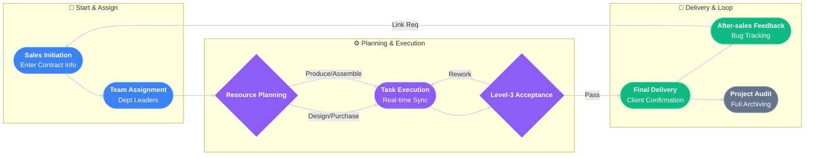

# CORE ERP v3.0.0 — Open Source Industrial Process Management System


> **One-Click Install, Ready for LAN Use** — Modern ERP designed for small and medium-sized manufacturers.

Built with Python Flask and Glassmorphism UI design, this project **focuses on the following enterprise-grade values**:

1.  **🖥️ One-Click Deployment**: Windows one-click installer, just double-click to run. Bundles Python runtime, SQLite database, and NSSM service manager — **zero dependencies, zero configuration**.
2.  **🌍 Zero-Cost Remote Office**: Provides complete **Tailscale / FRP / Cloud Server** three remote access solutions. Secure remote access without a public IP.
3.  **🛡️ Strict Permission Layering**: Implements a five-level permission isolation of **Admin-Boss-Department Leader-Staff-Client**, with invite code registration mechanism.
4.  **💬 Multi-Channel Notifications**: Integrates **WeCom, DingTalk, Email, and SMS** into a unified notification backend. Critical nodes can be manually configured to notify specific responsible persons.
5.  **📂 Structured File Management**: Files are automatically archived and isolated by **"Contract Number"** to ensure project materials are organized and do not interfere with each other.
6.  **📄 Real-Time Document Engine**: Built-in Office/PDF/Image preview engine allows drawings and technical documents to be viewed online without downloading.
7.  **👥 Flexible Team Management**: **Staff can be freely added or removed** during the contract lifecycle, and personnel profiles (name, email, contact info) automatically map to the notification backend.
8.  **📜 Full Operation Audit**: The system records **operation logs** of all personnel completely. Every change can be traced back to ensure system security.
9.  **📊 Full Process Closed Loop**: Covers the complete data loop from Contract Lifecycle to **Precise Schedule Management**, Production Task Tracking, and Organizational Architecture Management.

### 📖 For detailed feature demos, see [USER_GUIDE.md](USER_GUIDE.md) or [USER_GUIDE_EN.md](USER_GUIDE_EN.md).

---

## 🚀 Quick Start (3 Minutes)

### Option 1: One-Click Installer (Recommended · Non-technical Users)

For managers without a technical background — no code required.

1. **Download** the `CoreERP-Setup-v3.0.0.exe` installer
2. **Double-click to run**, click "Yes" on the UAC prompt
3. **Follow the wizard** (installs to `C:\CoreERP` by default), takes about 30 seconds
4. **Browser opens automatically**, entering the Setup Wizard:
   - Step 1: Enter company name
   - Step 2: Create admin account and password
   - Step 3: Done! Enter the system dashboard
5. **Tell staff the LAN address** (shown in the console on startup, e.g. `http://192.168.1.100:8000`)

> **What happens automatically after installation**:
> - ✅ CORE ERP is registered as a Windows service, starts on boot
> - ✅ Firewall automatically allows port 8000, LAN devices can access directly
> - ✅ Desktop shortcut created, double-click to open in browser

### Option 2: Source Code (Developers · Customization)

For developers with Python experience who need to customize features.

```bash
# 1. Clone the repository
git clone https://github.com/fortitudelucifer/erp_opensource.git
cd erp_opensource

# 2. Create virtual environment and install dependencies
python -m venv venv
venv\Scripts\activate        # Windows
pip install -r requirements.txt

# 3. Start development server
python run.py

# 4. Visit http://127.0.0.1:8000 — first run will enter the Setup Wizard
```

> **Note**: Source code mode uses SQLite database (`data/erp.db`) by default, zero configuration. To use SQL Server or PostgreSQL, modify `SQLALCHEMY_DATABASE_URI` in `config.py`.

---

## 🔄 Standard Workflow



```mermaid
graph LR
    %% Global Style Definition
    classDef start fill:#3b82f6,stroke:#60a5fa,color:#fff;
    classDef core fill:#8b5cf6,stroke:#a78bfa,color:#fff;
    classDef sync fill:#10b981,stroke:#34d399,color:#fff;
    classDef archive fill:#64748b,stroke:#94a3b8,color:#fff;

    subgraph PHASE1 ["🏁 Start & Assign"]
        A(["<b>Sales Initiation</b><br/>Enter Contract Info"])
        B(["<b>Team Assignment</b><br/>Dept Leaders"])
    end

    subgraph PHASE2 ["⚙️ Planning & Execution"]
        C{"<b>Resource Planning</b>"}
        D(["<b>Task Execution</b><br/>Real-time Sync"])
        E{"<b>Level-3 Acceptance</b>"}
    end

    subgraph PHASE3 ["🚀 Delivery & Loop"]
        F(["<b>Final Delivery</b><br/>Client Confirmation"])
        G(["<b>After-sales Feedback</b><br/>Bug Tracking"])
        H(["<b>Project Audit</b><br/>Full Archiving"])
    end

    %% Business Flow
    A --> B
    B --> C
    C -->|Design/Purchase| D
    C -->|Produce/Assemble| D
    D --> E
    E -->|Pass| F
    E -->|Rework| D
    F --> G
    G -->|Link Req| A
    F --> H

    %% Apply Styles
    class A,B start;
    class C,D,E core;
    class F,G sync;
    class H archive;

    %% Link Styling
    linkStyle default stroke-width:2px,stroke:#cbd5e1,fill:none;
```

### Detailed Steps

1.  **Create**:
    - Sales personnel create a new contract, filling in delivery date, contract number, project leader, client info, etc.
    - The system generates a unique project code.

2.  **Assign**:
    - Administrators assign Feature Leaders for different departments to the project.
    - Designated department leaders receive notifications.

3.  **Plan**:
    - Enter specific production Tasks, setting start/end times and content.
    - Automatically generate Gantt charts.
    - Department leaders can view their department's task progress anytime and manually set reminders.

4.  **Execute**:
    - Staff update task progress (0% -> 100%).
    - If procurement is needed, enter the procurement list and track arrival status.
    - Department leaders can view task progress and set reminders.

5.  **Accept**:
    - Initiate acceptance application after task completion.
    - QC personnel mark acceptance from "Under Review" to "Passed" or "Rejected".

6.  **Deliver & Feedback**:
    - Record final delivery time.
    - Record client feedback (Bugs/Requirements) and link back to specific projects for iteration.

7.  **Archive**:
    - Archive the project upon completion.
    - Project details can be filtered, queried, and traced.

---

## 🚀 Unique Features


### 1. Industrial Aesthetic Dashboard (Bento Grid)


Abandoning traditional table stacking, we adopted a Bento Grid style dashboard.

- **Multi-dimensional Visual Status**: Uses six-color light effects to semantically display project status:
  - 🟣 **Production**: Purple pulse, representing core manufacturing processes.
  - 🔵 **Processing**: Blue highlight, representing routine task progress.
  - 🟠 **Issue**: Orange warning, representing pending acceptance or feedback.
  - 🟢 **Accepted**: Green completion, representing error-free delivery.
  - 🔘 **Unstarted**: Grey silence, representing pending initiation.
  - 🔴 **Risk**: Red highlight (shown in Gantt chart), representing overdue progress.
- **Key Metrics**: The homepage intuitively presents core KPIs like "Active Contracts", "Pending Tasks", "Delivery This Month".

### 2. Interactive Gantt Chart

Built-in Frappe Gantt engine automatically generates dynamic timelines based on task start/end times.

- Supports drag-and-drop to view progress.
- Automatically calculates and highlights today's tasks.
- Displays the full project picture in Day/Week/Month views.

> **Contract Signed** ➔ **Task Issued** ➔ **Production/Procurement** ➔ **Internal Acceptance** ➔ **Client Delivery** ➔ **After-sales Feedback**

### 3. Enterprise RBAC & Security Boundaries


Not just simple login verification, the system implements strict **Role Layering and Data Isolation**:

- **Admin**: Highest system privilege — manage user accounts, configure system settings, access all data.
- **Boss**: God view, see all projects, finances, and employee performance.
- **Leader**: Can only manage project tasks and personnel for their own department.
- **Staff**: Can only access tasks they participate in and authorized files.
- **Customer**: Can only view progress of contracts related to their own company, absolutely isolated.

### 4. Real-time Document Preview Engine

Built-in powerful file processing engine turns the ERP into an enterprise knowledge base. Preview directly in the browser without downloading:

- **Office Docs**: Supports Word (`.docx`), Excel (`.xlsx`), PPT (`.pptx`).
- **Pro Formats**: Supports PDF and various high-def images.
- **Underlying Tech**: Uses LibreOffice conversion service and PDF.js rendering, smooth and highly compatible.

### 5. Structured (Isolated) File System

The system has deeply optimized attachment storage to ensure rigorous data management:

- **Contract Alignment**: All uploaded files are strictly mounted under the corresponding "Contract Number" directory.
- **Physical Isolation**: Files of different contracts are unconnected at the server storage level, preventing data confusion at the source.
- **Version Management**: Supports version iteration for the same file, retaining historical versions to prevent accidental overwrites.

### 6. Full Operation Audit Logs


The system comes with a "Black Box" function that records every important action within the system:

- **Who did What**: Precisely records the operator, operation time, IP address, and specific changes (including value comparison before and after modification).
- **Traceability**: Administrators can retrieve audit logs by date, project, or personnel in the background.
- **Security Guarantee**: Provides a complete data change chain for the enterprise, a tool for internal risk control and responsibility tracing.

### 7. Multi-channel Notification

The system has a built-in modular notification backend supporting the following channels:

- **WeCom / DingTalk**: Sync critical project changes (e.g., task assignment, contract overdue) via group robots.
- **Email Service**: Send formal business reminders and reports.
- **SMS**: For high-priority urgent events, ensuring messages are delivered in time.
- **Configuration**: Configure the corresponding Token/API in the system "Settings → Basic Settings" page.

### 8. Flexible Team Management


Addressing the frequent personnel changes and complex collaboration in manufacturing, the system provides a structured team management scheme:

- **Structured Profiles**: Supports detailed profiles for each team member, including **Name, Personal Email, Phone Number**, WeChat ID, and Department.
- **Auto-Mapping Notifications**: The core advantage lies in the **automatic mapping** between profiles and the notification system. Once a person is assigned as a leader in a project, the system automatically retrieves contact info from their profile to reach them accurately via Email, SMS, or WeCom.
- **Free Addition/Removal**: In "Project Details - Leader Management", you can add or remove assisting leaders for each department at any time, dynamically adapting to project scale.
- **Permission Linkage**: Permissions update in real-time as personnel enter or leave projects, without manually resetting account permissions, guaranteeing data security.

---

## 🌍 Remote Access Solutions


The system has built-in detailed tutorials for three remote access solutions (located in "Settings → Remote Access"):

| Solution | Best For | Difficulty | Cost |
|----------|----------|------------|------|
| **Tailscale (Recommended)** | Small team, occasional remote | ⭐ Simple | Free |
| **FRP Tunnel** | Technical team, fixed external address needed | ⭐⭐⭐ Medium | Cloud server ~¥50-100/mo |
| **Cloud Server Deployment** | Stable long-term, multi-user remote | ⭐⭐⭐⭐ Advanced | ¥100-300/mo |

### Tailscale Quick Start

1. Sign up at [tailscale.com](https://tailscale.com/) (recommended: use Microsoft account)
2. Install Tailscale on both the ERP server machine and remote devices
3. Log in with the same account, access ERP via the assigned `100.x.x.x` address

> Detailed FRP and cloud server tutorials are built into the system Settings page.

---

## ❓ Troubleshooting

**Q1: "Access Denied" error during installation?**

- **Cause**: Installation requires admin privileges.
- **Solution**: Right-click the installer → "Run as Administrator".

**Q2: Other computers on LAN can't access the system?**

- **Check**: Confirm both computers are on the same LAN (same Wi-Fi or wired network).
- **Solution**: Check if Windows Firewall allows port 8000 (the installer configures this automatically, but third-party firewalls may block it).

**Q3: Forgot the admin password?**

- **Solution**: Delete `C:\CoreERP\data\erp.db` and `C:\CoreERP\data\config.json`, then restart the service to re-enter the Setup Wizard.
- ⚠️ **Warning**: This will erase all data. Back up the `data` folder first.

**Q4: How to back up data?**

- Periodically copy the `C:\CoreERP\data\` folder to a USB drive or cloud storage. The core data file is `data/erp.db`.

**Q5: How to update to a new version?**

- Back up the `data` folder → Download new installer → Install over existing directory → Data is preserved automatically.

**Q6: Port 8000 is occupied?**

- **Check**: Run `netstat -ano | findstr :8000` to find the occupying process.
- **Solution**: Modify the `--port` parameter in `launcher.py`, or close the program using the port.

**Q7: `Non-UTF-8 code` error on startup? (Developers)**

- **Solution**: In VSCode, convert the file encoding to **UTF-8 without BOM**.

---

## ⚙️ Customization Guide

The system presets some logic for manufacturing scenarios, which you can easily modify according to actual needs:

### 1. Modify Roles

Current role permission mapping logic (e.g., `admin`, `boss`, `sales`) is located in:

- **File**: `core/contracts.py`
- **Function**: `normalize_role()`
- **Note**: You can add new role mappings (e.g., `"Inspector": "qc"`) in the dictionary and extend corresponding permission decorators in `auth.py`.

### 2. Modify Departments

Department data is stored in the `department` table in the database.

- **Default**: Purchasing, Sales, Mechanical, Electrical, Software, Assembly.
- **Modify**: Operate directly on the database, or write a Python script calling `db.session.add(Department(name="New Dept"))` to initialize.

### 3. Modify File Types

File type dropdown options (Contract, Tech Doc, Drawing, Others) are in the frontend template:

- **File**: `core/templates/contracts/files.html`
- **Location**: Search `<select name="file_type">`
- **Modify**: Directly add/delete `<option>` tags in HTML.

### 4. More Hardcoded Modifications

- **`config.py`** (dev mode): Database URI, secret key, brand name, etc. For notification Token/API configuration, use the system "Settings → Basic Settings" page instead of editing code directly.

---

## 📂 File Structure

```text
erp_opensource/
├── config.py                # [Config Center] DB URI, Keys, Brand Name, etc. (dev mode)
├── run.py                   # [Dev Entry] python run.py to run locally (Port 8000)
├── wsgi.py                  # [Deploy Entry] Production interface for Waitress/Gunicorn
├── launcher.py              # [Service Entry] Installer launcher, manages service lifecycle
├── requirements.txt         # [Dependencies] Flask, SQLAlchemy, Waitress, etc.
│
├── installer/               # [Installer Build]
│   ├── build.py             #   Build script: bundle Python + deps + source
│   ├── core_erp.iss         #   Inno Setup installer script
│   ├── requirements_build.txt  # Build-specific dependencies
│   └── downloads/           #   Python Embedded / NSSM cache
│
├── data/                    # [Runtime Data] (auto-generated after installation)
│   ├── erp.db               #   SQLite database (all business data)
│   ├── config.json          #   System config (company name, invite code, etc.)
│   ├── uploads/             #   Uploaded file storage
│   └── service.log          #   Service runtime logs
│
└── core/                    # [Core App Package]
    ├── __init__.py          #   App Factory: register blueprints, DB, auth
    ├── models.py            #   Data Models: User, Contract, Task, etc.
    ├── auth.py              #   Auth: login / register / invite code verification
    ├── contracts.py         #   Business Logic: contract / project / task management
    ├── org.py               #   Org: department & personnel CRUD
    ├── logs.py              #   Audit: operation log display & query
    ├── operation_log.py     #   Log recording module
    ├── setup_wizard.py      #   [v3 New] First-run setup wizard
    ├── settings.py          #   [v3 New] System settings (company / remote / system info)
    ├── user_mgmt.py         #   [v3 New] User management (CRUD + role assignment)
    ├── help.py              #   [v3 New] Help center FAQ
    │
    ├── services/            #   [Service Layer] Complex business logic
    │   ├── production_service.py
    │   ├── procurement_service.py
    │   ├── acceptance_service.py
    │   ├── feedback_service.py
    │   ├── file_service.py
    │   ├── preview_service.py
    │   ├── notification_service.py
    │   └── common_utils.py
    │
    ├── static/              #   [Static Assets]
    │   ├── css/             #     theme.css, components.css (Glassmorphism styles)
    │   ├── js/              #     main.js (interaction scripts)
    │   └── img/             #     logo.svg (brand logo)
    │
    └── templates/           #   [View Layer] Jinja2 Templates
        ├── base.html        #     Global layout: navbar, logo, responsive container
        ├── home.html        #     Dashboard: Bento Grid + first-login onboarding card
        ├── auth/            #     Login / Register (logo + gradient background animation)
        ├── contracts/       #     Project details, task board, Gantt chart, file library
        ├── admin/           #     [v3 New] System settings, user management
        ├── setup/           #     [v3 New] Setup wizard 3-step flow
        ├── help/            #     [v3 New] Help center FAQ
        ├── logs/            #     Operation log query
        └── org/             #     Department & personnel management
```

---

## 📸 Screenshots & Guide

> 📖 **[Click to view full System User Guide (USER_GUIDE_EN.md)](USER_GUIDE_EN.md)**
> This manual includes interface demos for **Setup Wizard, Dashboard, Project Management, User Management, Help Center**, and all other modules.


---

## 📄 License

This project is licensed under the **Apache License 2.0**.

This means you can:

- ✅ **Commercial Use**: Freely use this system for commercial closed-source products.
- ✅ **Modify**: Freely modify code to adapt to your business needs.
- ✅ **Distribute**: Copy and distribute copies of this project.

But you must comply with the following obligations (i.e. "Attribution"):

- ⚠️ **Keep Copyright Notice**: You must retain the original LICENSE file and copyright notice in all copies or derivatives.
- ⚠️ **State Changes**: If you modify files, you need to state so.

## 🤝 Contribution & Security

Authors welcome community participation!

- **Want to Contribute?** Please read [Contributing Guide (CONTRIBUTING_EN.md)](CONTRIBUTING_EN.md) to learn how to submit Issues and Pull Requests.
- **Found a Security Vulnerability?** Please refer to [Security Policy (SECURITY.md)](SECURITY.md) to learn how to responsibly report security issues.

---

## 👨‍💻 Author

- **Author**: [fortitudelucifer](https://github.com/fortitudelucifer)
- **GitHub**: [https://github.com/fortitudelucifer](https://github.com/fortitudelucifer)
- **Note**: Welcome to submit Issues or Pull Requests on GitHub to jointly improve this modern industrial ERP framework.
