# 📚 系统功能演示手册 / System User Guide

本手册结合真实系统截图，为您详细介绍 **CORE ERP v3.0.0** 的各个核心功能板块。

---

## 0. 🚀 安装与部署

### 一键安装（推荐）

CORE ERP 提供 Windows 一键安装包，无需任何技术背景：

1. **下载** `CoreERP-Setup-v3.0.0.exe`
2. **双击运行**安装程序，UAC 弹窗点击「是」
3. 按照安装向导点击「下一步」，等待安装完成（约 30 秒）
4. 安装完成后**浏览器自动打开**

> **安装后你会得到：**
> - ✅ CORE ERP 作为 Windows 服务在后台运行，开机自动启动
> - ✅ 桌面快捷方式，双击即可打开系统
> - ✅ 防火墙自动放行，局域网内其他设备可直接访问
> - ✅ 数据存储在 `C:\CoreERP\data\` 目录

### 源码运行（开发者）

如果您是开发者，需要二次开发或调试：

```bash
git clone https://github.com/fortitudelucifer/erp_opensource.git
cd erp_opensource
python -m venv venv
venv\Scripts\activate
pip install -r requirements.txt
python run.py
# 访问 http://127.0.0.1:8000
```

---

## 1. 🛠️ 设置向导 (Setup Wizard) — v3 新增

首次启动时，系统会自动进入设置向导，引导您完成初始化：

### Step 1：公司信息
- 填写**公司名称**，将显示在系统标题栏和导航栏
- 系统自动生成 6 位**邀请码**，用于员工注册验证

### Step 2：管理员账号
- 创建系统管理员账号（用户名 + 真实姓名 + 密码）
- 此账号拥有最高权限，可管理所有功能

### Step 3：完成
- 点击「开始使用」进入系统仪表盘
- 管理员首次登录后会看到**引导卡片**（5 步快速上手）

> ⚠️ 设置向导只在首次启动时出现。完成后配置保存在 `data/config.json`。

---

## 2. 🎉 首次登录引导 (Onboarding) — v3 新增

管理员首次登录后，仪表盘顶部会显示一个引导卡片，帮助快速上手：

| 步骤 | 内容 | 操作 |
|------|------|------|
| ① 查看邀请码 | 员工注册需要此邀请码 | → 跳转设置页查看 |
| ② 创建员工账号 | 为每位员工创建账号并分配角色 | → 跳转用户管理 |
| ③ 告诉员工地址 | 将局域网地址告诉员工 | 显示当前访问 URL |
| ④ 了解核心功能 | 项目管理、部门人员、操作日志 | → 跳转帮助中心 |
| ⑤ 完成 | 您已掌握基本操作 | 关闭引导 |

点击「不再显示」后，引导卡片将永久隐藏。

---

## 3. 认证与安全 (Authentication)

系统提供安全的登录与注册机制，支持多种角色的权限隔离。

### 登录
- 支持用户名或真实姓名登录
- 登录页带有品牌 Logo 和渐变背景动效

### 注册（需邀请码）
- 员工注册需要输入管理员提供的 **6 位邀请码**
- 填写用户名、真实姓名、手机号、企业微信号等信息
- 注册后默认角色为 `employee`（普通员工）

### 角色权限

| 角色 | 权限范围 |
|------|---------|
| **admin** | 系统管理员，拥有所有权限 |
| **boss** | 老板/总经理，查看所有数据和报表 |
| **manager** | 部门经理，管理本部门项目和人员 |
| **employee** | 普通员工，查看和处理分配的任务 |
| **customer** | 客户，仅查看相关合同进度 |

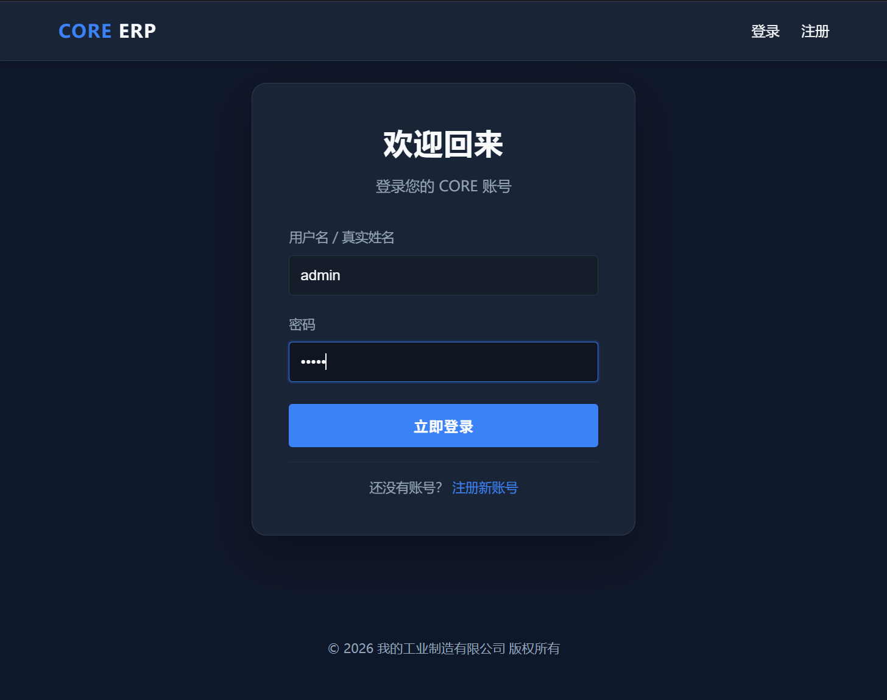

---

## 4. 全局看板 (Dashboard)

采用 Bento Grid 风格的现代化仪表盘，直观呈现企业核心 KPI：

- **多维状态可视化**: 六色光效语义化展示项目状态
- **关键指标**: 合同总数、进行中、预警项目、本月交付
- **项目交付趋势图**: ECharts 折线图展示近 6 个月趋势
- **部门负载分布**: ECharts 饼图展示各部门任务占比
- **最近操作日志**: 实时显示系统最新操作记录
- **快捷入口**: 一键创建合同、查看所有项目


---

## 5. 项目与合同管理 (Project Management)

### 5.1 项目列表 (Project List)

以卡片或列表形式展示所有合同，支持按状态快速筛选。管理员可在此处一键创建新立项。

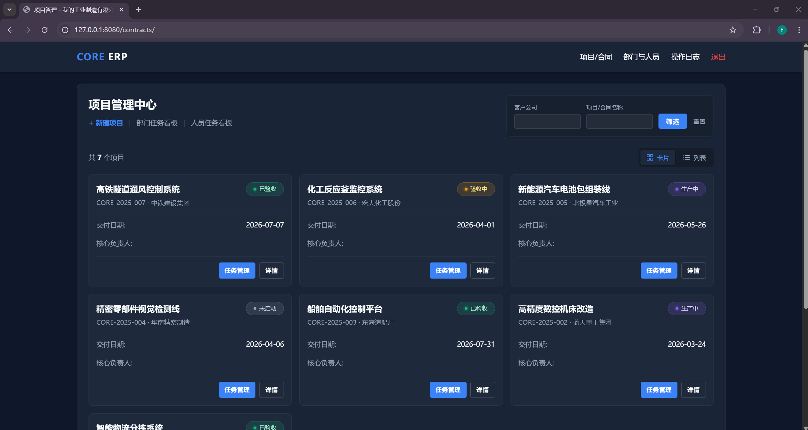

### 5.2 项目概览 (Project Overview)

点击任意项目进入详情页，这里是项目管理的"驾驶舱"。您可以查看项目基本信息、进度概况以及所有关联的子模块入口。

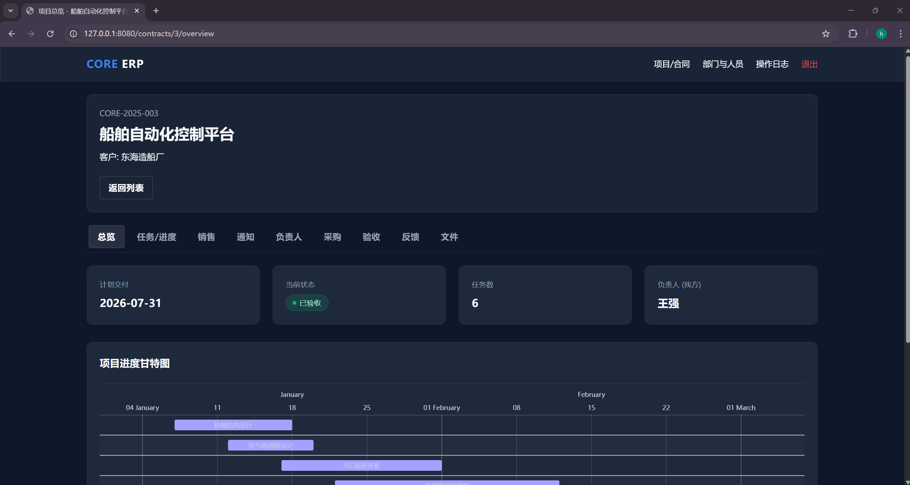

### 5.3 销售与报价 (Sales Info)

记录合同的报价金额、成交日期及销售负责人，实现从销售端到生产端的无缝衔接。

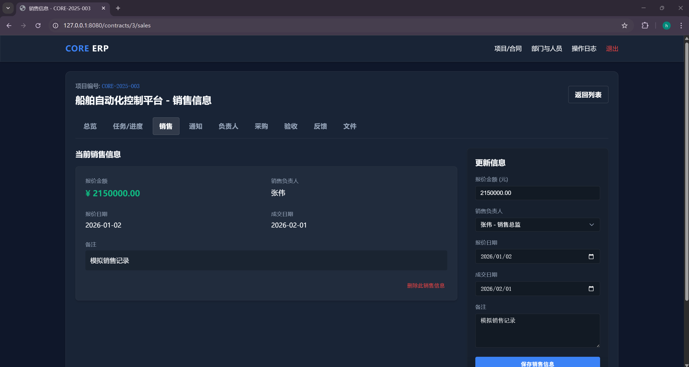

### 5.4 团队指派 (Team Assignment)

灵活的矩阵式管理。管理员可为每个项目指定各职能部门（机械、电气、软件等）的负责人，系统会自动通知相关人员。

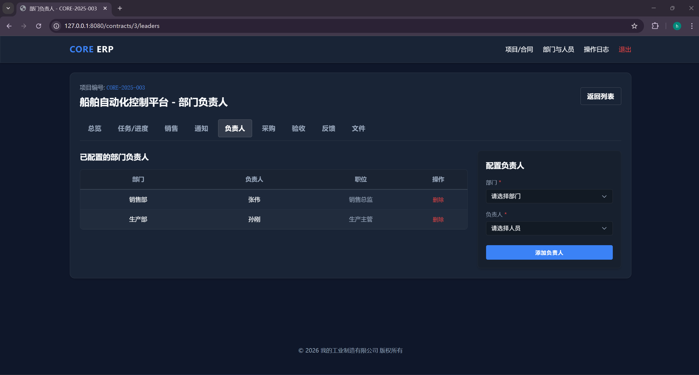

---

## 6. 生产任务与排期 (Tasks & Scheduling)

### 6.1 任务管理 (Task Management)

核心生产环节的执行中心。支持任务的增删改查，实时更新进度（0% - 100%）。

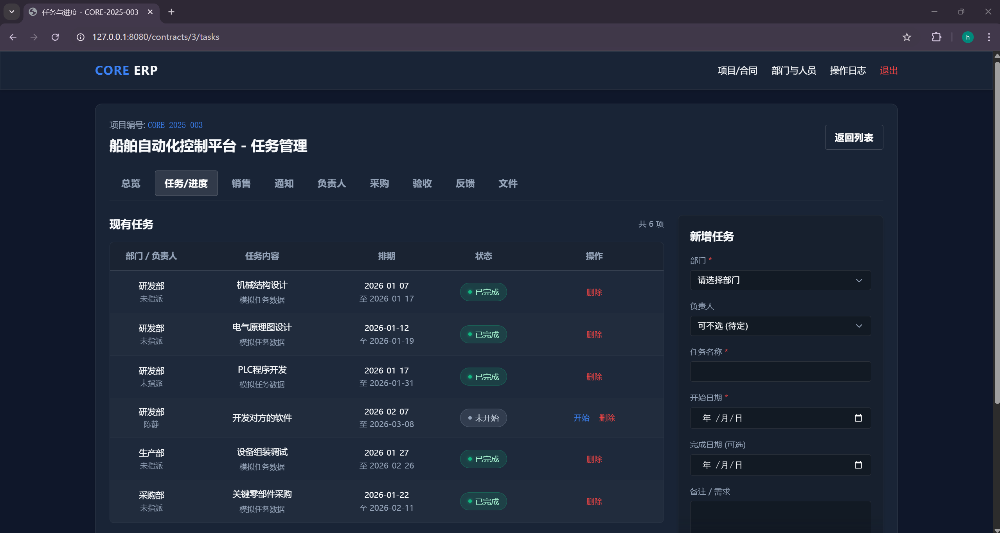

### 6.2 任务概览与甘特图 (Task Overview)

可视化展示项目进度条和关键节点，帮助管理者把控整体工期。

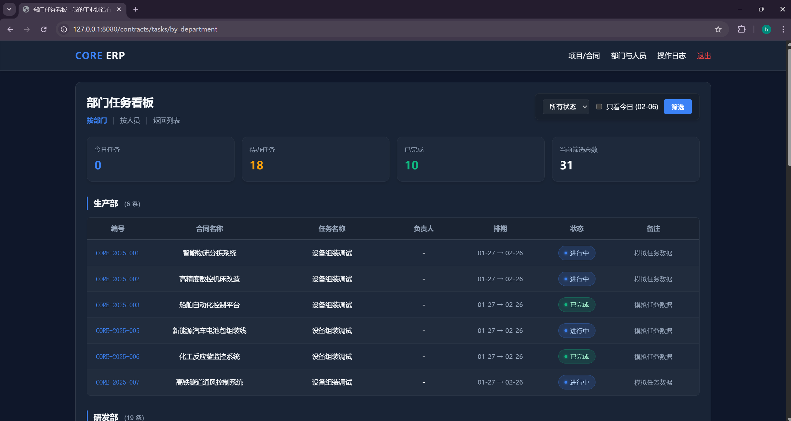

### 6.3 个人任务视图 (Personal View)

员工可专注查看"指派给我的"任务，减少信息干扰，提升执行效率。

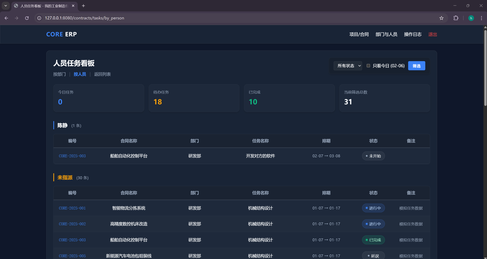

---

## 7. 供应链与交付 (Supply Chain & Delivery)

### 7.1 采购管理 (Procurement)

项目维度的采购清单管理。追踪物料的下单、到货状态，确保生产物料及时到位。

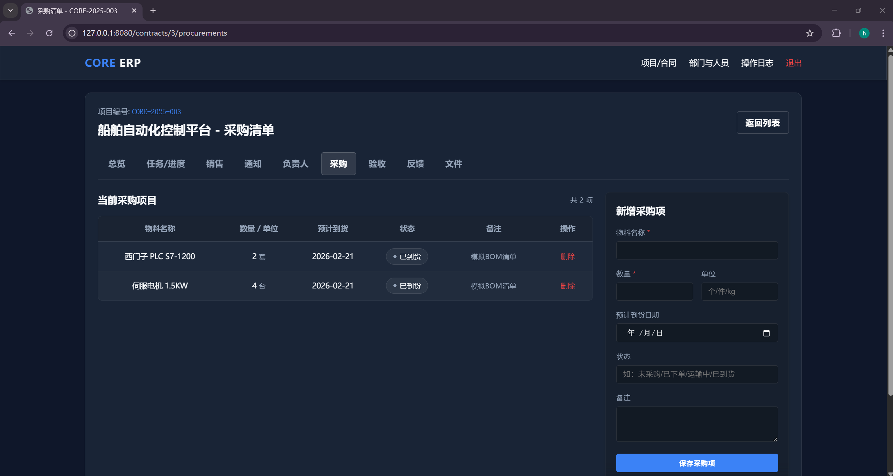

### 7.2 验收流程 (Acceptance)

支持多级验收体系（FAT 出厂验收 / SAT 现场验收）。质检人员可在线标记验收结果（通过/不通过）。

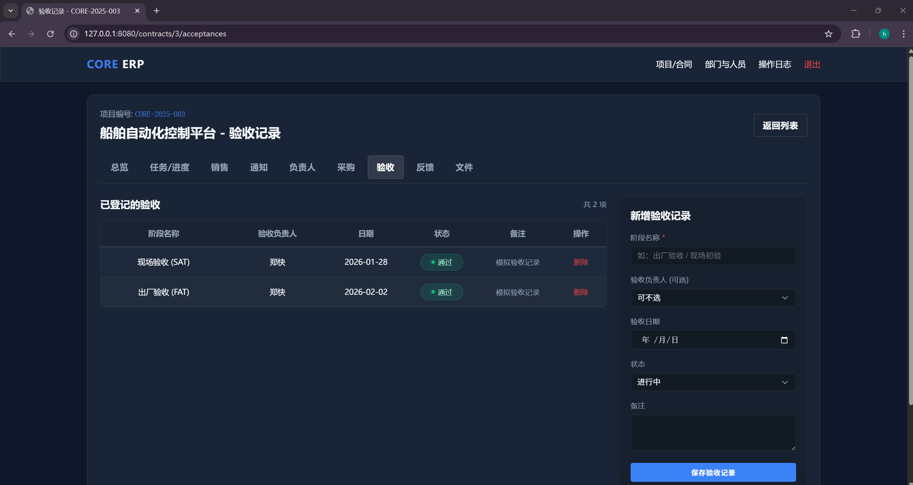

### 7.3 售后反馈 (Feedback)

闭环管理的最后一环。记录客户在交付后的反馈与问题，并指派专人处理，支持追踪解决进度。

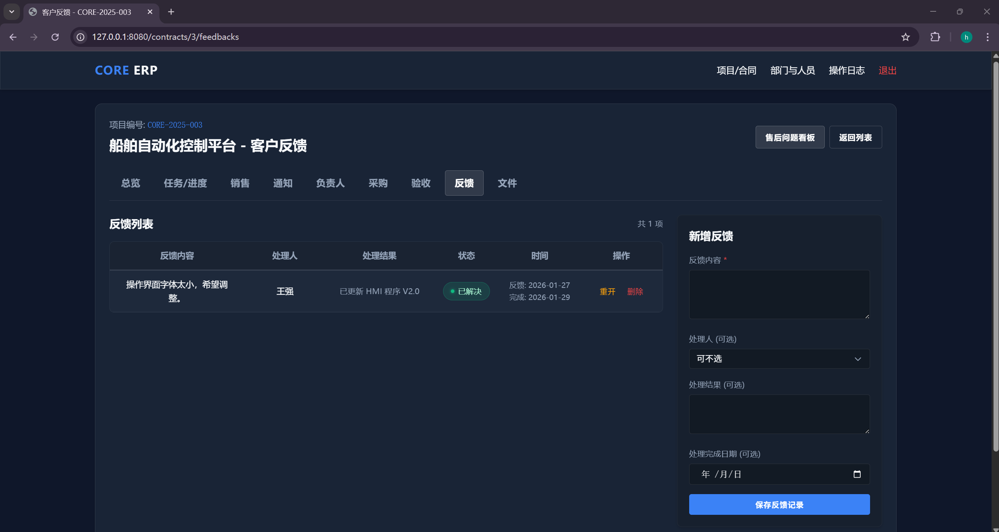

---

## 8. 知识库与文件管理 (File Management)

系统自动为每个合同建立独立的文件归档空间。支持合同扫描件、技术图纸、验收报告的上传与版本管理，确保资料不丢失、不混淆。

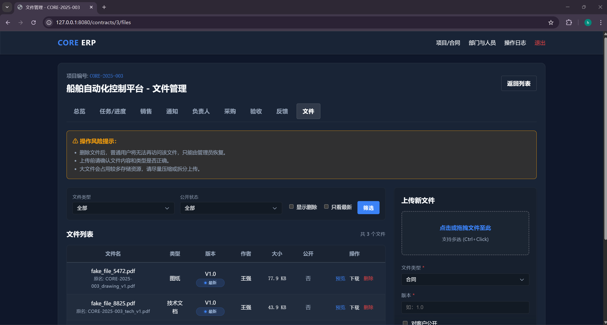

---

## 9. 组织架构 (Organization)

### 9.1 部门管理 (Departments)

自定义企业职能部门（如研发部、采购部、生产部），构建清晰的组织树。

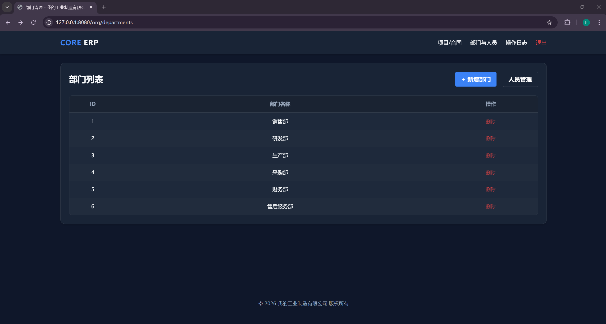

### 9.2 人员档案 (Personnel)

维护员工详细信息（电话、邮箱、微信）。系统利用这些信息实现自动化的消息通知触达。

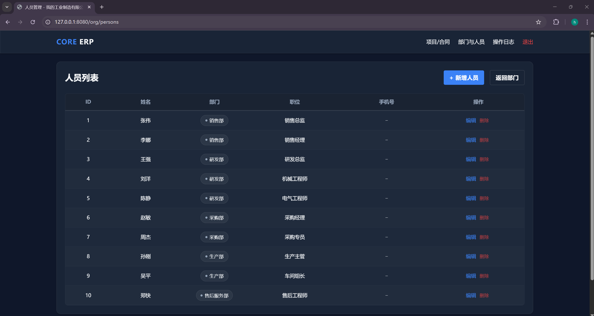

---

## 10. 审计与通知 (Audit & Notification)

### 10.1 操作日志 (Operation Logs)

系统自带"黑匣子"，完整记录所有人员的增删改查操作，支持多维度追溯，保障数据安全。

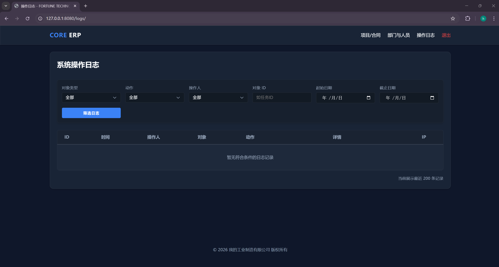

### 10.2 消息通知 (Notifications)

集成多通道通知（邮件、钉钉、企微），确保关键任务变动及时触达相关负责人。

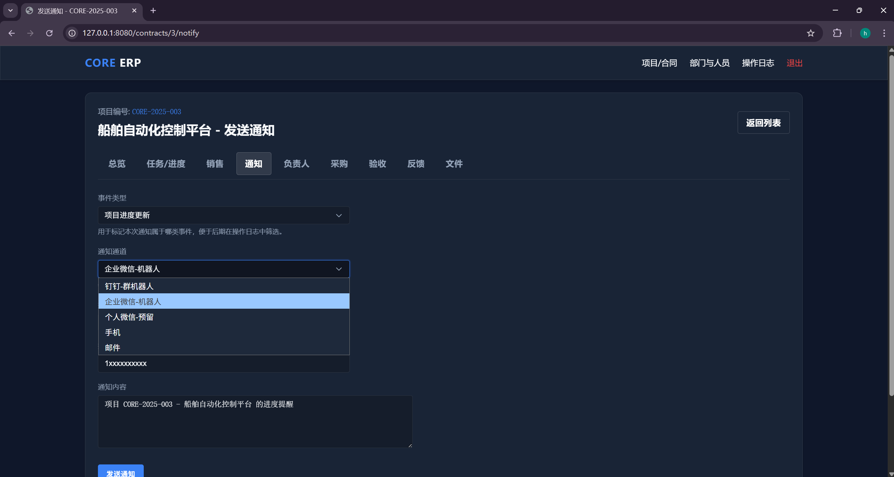

---

## 11. 👥 用户管理 (User Management) — v3 新增

仅 **admin** 和 **boss** 角色可访问（导航栏「管理 → 用户管理」）。

### 功能
- **查看用户列表**: 所有注册用户的用户名、真实姓名、角色、注册时间
- **创建用户**: 管理员直接为员工创建账号，无需邀请码
- **编辑用户**: 修改用户角色、联系方式等信息
- **删除用户**: 移除不再需要的账号
- **角色分配**: 从 admin / boss / manager / employee / customer 中选择

---

## 12. ⚙️ 系统设置 (Settings) — v3 新增

仅 **admin** 和 **boss** 角色可访问（导航栏「管理 → 系统设置」），包含三个 Tab 页：

### Tab 1：基本设置
- **公司名称**: 修改显示在系统标题栏的公司名
- **邀请码管理**: 查看当前邀请码、一键重新生成

### Tab 2：远程访问
提供三种互联网远程访问方案的详细教程：

| 方案 | 难度 | 成本 |
|------|------|------|
| **Tailscale**（推荐） | ⭐ 简单 | 免费 |
| **FRP 内网穿透** | ⭐⭐⭐ 中等 | ¥50-100/月 |
| **云服务器部署** | ⭐⭐⭐⭐ 较难 | ¥100-300/月 |

每个方案都有可折叠的详细步骤说明和配置示例。

### Tab 3：系统信息
- **服务状态**: 显示 Windows 服务运行状态（运行中/已停止）
- **运行时间**: 显示服务已运行时长
- **版本信息**: 当前版本号
- **重启服务按钮**: 一键重启 CORE ERP 服务
- **关于**: 版本号、技术栈、开源协议、GitHub 链接

---

## 13. ❓ 帮助中心 (Help Center) — v3 新增

所有已登录用户可访问（导航栏「❓ 帮助」）。

### 功能
- **分类标签**: 🚀快速开始 | 📋项目管理 | 👥用户权限 | 🔧系统维护
- **FAQ 手风琴**: 点击问题展开答案，再次点击收起
- **15+ 常见问题**: 涵盖从注册登录到数据备份的完整使用指南

### FAQ 示例
- 管理员如何创建员工账号？
- 如何查看和设置邀请码？
- 员工如何注册和登录？
- 局域网内的其他电脑如何访问系统？
- 如何备份数据？
- 服务无法启动怎么办？
- 如何更新到新版本？

---

## ❓ 常见问题 (Troubleshooting)

**Q1: 安装时弹出「拒绝访问」错误?**

- **原因**: 安装需要管理员权限。
- **解决**: 右键安装包 → 「以管理员身份运行」。

**Q2: 局域网其他电脑无法访问?**

- **检查**: 确认两台电脑在同一局域网（同一 WiFi 或有线网络）。
- **解决**: 检查 Windows 防火墙是否放行了 8000 端口（安装包会自动配置，但手动安装的防火墙软件可能拦截）。

**Q3: 忘记管理员密码?**

- **解决**: 删除 `C:\CoreERP\data\erp.db` 和 `C:\CoreERP\data\config.json`，重启服务后重新初始化。
- ⚠️ **注意**: 这会清除所有数据，请提前备份 `data` 文件夹。

**Q4: 如何备份数据?**

- 定期复制 `C:\CoreERP\data\` 文件夹到U盘或网盘即可。核心数据文件为 `data/erp.db`。

**Q5: 如何更新版本?**

- 先备份 `data` 文件夹 → 下载新版安装包 → 覆盖安装到相同目录 → 数据自动保留。

**Q6: 端口 8000 被占用?**

- **检查**: `netstat -ano | findstr :8000` 查看占用进程。
- **解决**: 修改 `launcher.py` 中的 `--port` 参数，或关闭占用端口的程序。

**Q7: 启动时报错 `Non-UTF-8 code`? (开发者)**

- **解决**: 在 VSCode 中将报错文件编码转换为 **UTF-8 without BOM**。
